最开始知道这部作品是逛小黑盒的时候看到的，忘记了是哪位作者发的，也忘记了是什么评价，只记得里面有提到说和女主克里斯有一张很好看的 CG，正好那时候对男扮女装的题材有点兴趣就入了坑。

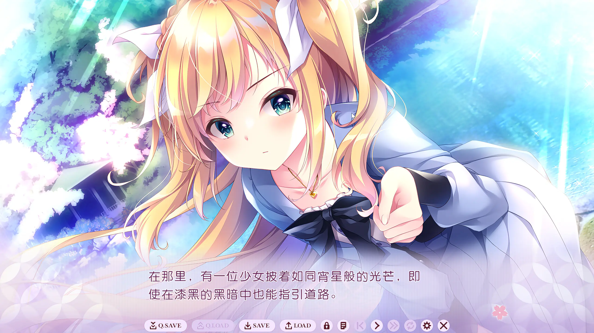

这是男女主初次相遇的场景。男主山科凛的父亲是久负盛名的歌舞伎女形演员，自然他也继承了父亲的衣钵；男主虽然在此道上亦颇有造诣，但终究还是在某次舞台遭遇了重大挫折，一路跑到与女主克里斯相遇的这条湖边。女主克里斯是出身历史悠久的名门贵族的英国留学生，全名克里斯蒂娜·怀特，金毛傲娇萝莉，我一下就喜欢上了，玩完之后也开始对 cv 北见六花产生了浓厚的兴趣。

这部作品是 ensemble 第 28 部企划，属于他们一脉相承的「乙女系列」——男主角女装潜入女校的题材。舞台被放在了大正十年，差不多正好是一百年前，和服、洋装、女学生与贵族小姐在同一个画面里并存的年代。歌舞伎里的「女形」本就是男人去扮演被理想化的女性，而这部作品干脆把这层设定推到极致：一个以扮演女人为业的男人，真的去当了一回女人。

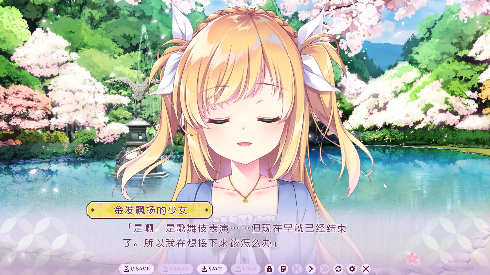

「是啊，是歌舞伎表演……但现在早就已经结束了。所以我在想接下来该怎么办。」湖边的克里斯说出这句话的时候，我还没意识到它的分量。要到很久以后我才知道，那场「早就结束了的歌舞伎」，对她而言意味着什么。

## 一个男人，扮成少女，混进女学校

舞台落幕后的山科凛被克里斯的一句话点醒，索性以「藤波凛」之名混进了女校，想借此磨练自己的女形之道。等待他的，是代表全校女学生的精英组织「英华会」，以及一场要从英华会五人中选出「撫子之君」——女校之巅那位唯一少女——的选举。

而校长把男主推为「和风派」的头号候选，与之针锋相对的「洋风派」头号候选，正是克里斯。于是这段关系从一开始就被钉死在一个尴尬的位置上：他要赢的人，恰恰是他最在意的那个人。

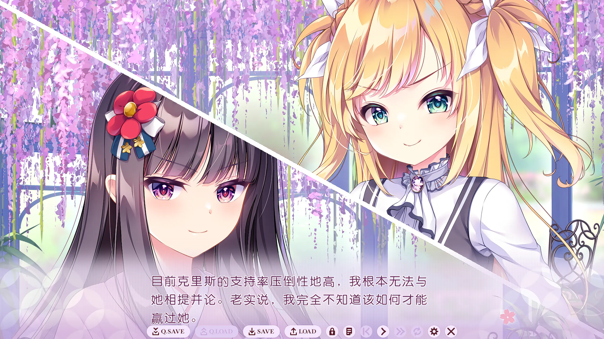

「目前克里斯的支持率压倒性地高，我根本无法与她相提并论。老实说，我完全不知道该如何才能赢过她。」

克里斯是那种天生站在聚光灯里的人。明明身形娇小，却被人形容成「虽小，却如金色光芒般华美而耀眼」；她精通速读与西洋剑术，举手投足都带着一股骑士般的英气，西风派的女孩子们为她痴狂。她讨厌筷子、讨厌依赖别人、也讨厌男人——唯独对凛，她那份骄傲里藏着一点说不清的别扭。

## 在女校的日子，她藏不住的可爱

选战归选战，真正让我陷进去的，是克里斯这个人本身。她是标准的傲娇，对凛永远摆出一副不服输的架势，可只要相处久了，那身骄傲的盔甲就一点点露出底下的破绽。

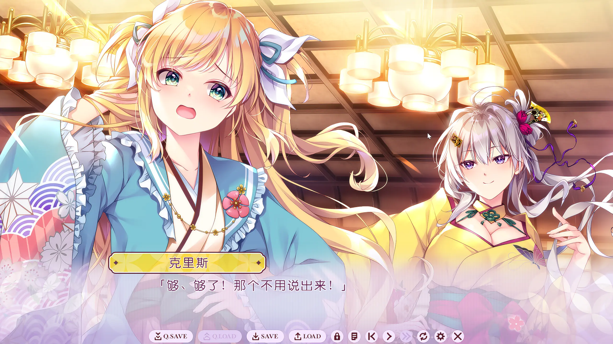

「够、够了！那个不用说出来！」

在学校里换上和服、被英华会的同伴当面打趣，她瞬间就慌了神，和台上那个英姿飒爽的「金色王子」判若两人。也正是在这些日常的缝隙里，我慢慢明白：那身盔甲底下，住着一个其实很容易害羞、也很想被人好好看见的女孩子。

## 当我们成为恋人时，她还以为彼此都是少女

这条线最有意思的设定，在于它先让两个人「以少女的身份」相爱了——克里斯始终把「藤波凛」当成同性的同窗，她动心、靠近、最后认定的，是这个她以为也是女孩子的人。

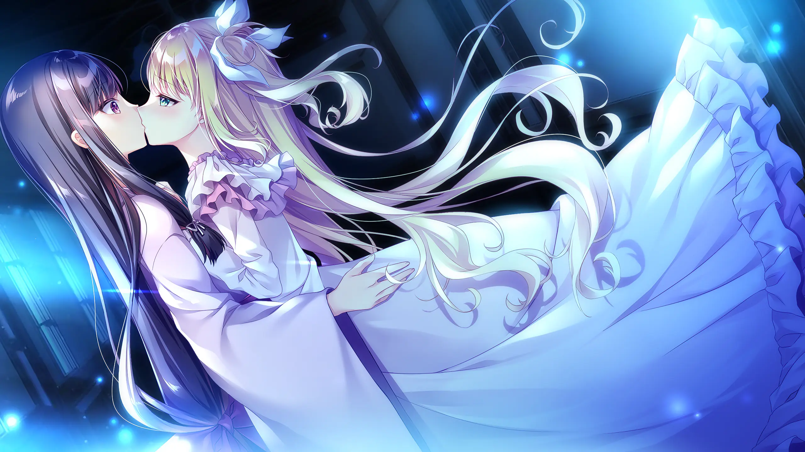

也就是当初让我入坑的那张 CG。黑发的凛（女装姿）与金发的克里斯交叠在一起，蓝色的光晕里，长发漫成一片。说实话，光是这一张，我就觉得不虚此行了。

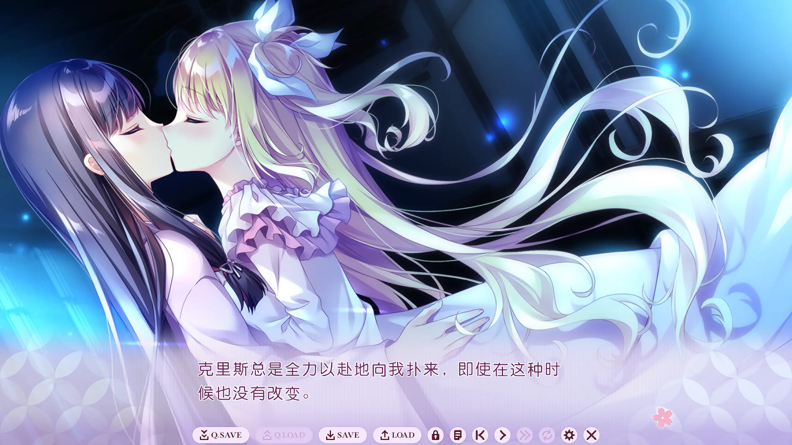

「克里斯总是全力以赴地向我扑来，即使在这种时候也没有改变。」她做什么都是拼尽全力的性子，连撒娇和亲近也一样，毫无保留。

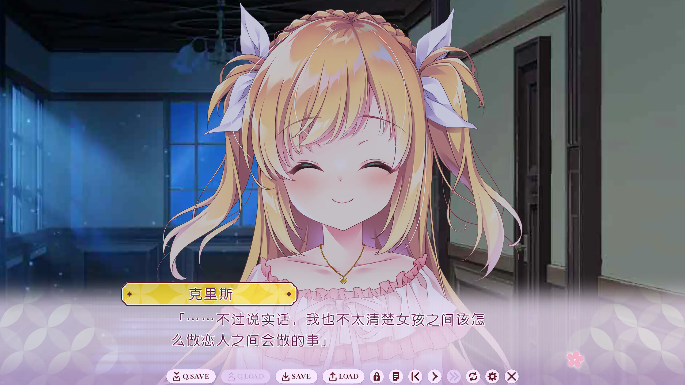

「……不过说实话，我也不太清楚女孩子之间该怎么做恋人之间会做的事。」

这句话恰恰点破了这段关系当下的底色：在克里斯心里，这是一段「少女与少女」的恋爱。她紧张、笨拙、对怎么和「另一个女孩子」相处毫无头绪，却依然认真得要命。

而站在凛的角度，这份甜蜜里始终绷着一根弦——他清楚地知道，自己藏着一个迟早瞒不住的秘密。两个人越是靠近，那根弦就绷得越紧。

## 藏不住的秘密

相恋之后，凛注意到克里斯脖子上挂着一枚小小的盒式吊坠，里头收着一张照片。克里斯说，那是给过她力量的、对她而言无比重要的人。

那天夜里，凛一个人在浴室里出神地想着那枚吊坠的事，没料到克里斯会突然闯进来——她是怕凛为这吊坠吃醋，急着进来想解释清楚。可门一开，凛瞒了这么久的男儿身，就这样毫无遮掩地撞进了她眼里。两人相对无言，凛慌忙披上衣服逃回房间，一路上怎么也想不出该如何开口，满心以为一切到此为止。

## 明明那么害怕男人，她还是留下了他

要理解这一幕的分量，得先知道克里斯为什么会那样怕男人。她的父亲是派驻此国的外交官、也是西化改革的领头人，却从来只夸自己的哥哥；无论克里斯在剑术、马术上多么拼命，把哥哥远远甩在身后，父亲也只认一句「女人不该做多余的事」，从不给她一句肯定。她之所以执着于撫子之君，最初正是想借此换来父亲的承认。一个在父亲那里屡屡碰壁的女孩，会对「男性」整个儿心怀戒备，本就再自然不过。

偏偏命运给她开了一个不大不小的玩笑——她拼了命想要靠近、最后认定的那个人，恰恰就是一个男人。换作别人，在知道真相的那一刻，也许早该转身逃开了。可克里斯没有。她追了上来，没有半分嫌弃，反而轻声问起凛的真名。她害怕的，是「男性」这个笼统的概念；而她认定的，是具体的这一个人。原本一切都该到此为止，是她，让故事得以继续。

## 原来我们很久以前就见过

她问的那个真名，揭开了这条线最重要的底牌——凛和克里斯，并不是在那条湖边才第一次相遇的。

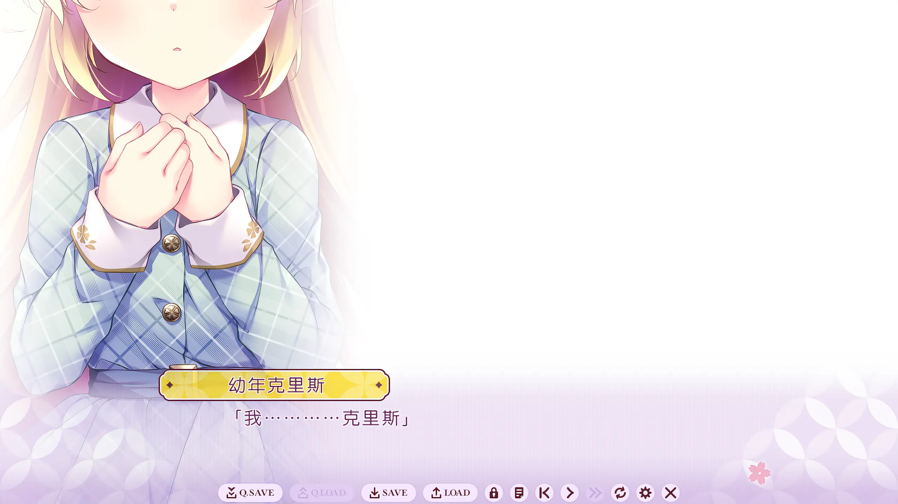

「我…………克里斯。」

凛的艺名，叫做山科一花。而克里斯那枚吊坠里珍藏了一辈子的照片，正是这个「一花」。很多年前，还是孩子的克里斯看过一场歌舞伎，台上那个被她当成「王子殿下」的身影，就是幼年的凛。一个以扮演女性为业的男孩子，却在那个外国小女孩眼里像个不折不扣的王子，这本身就是这部作品最妙的一处反差。

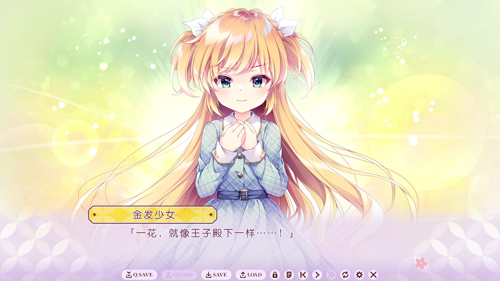

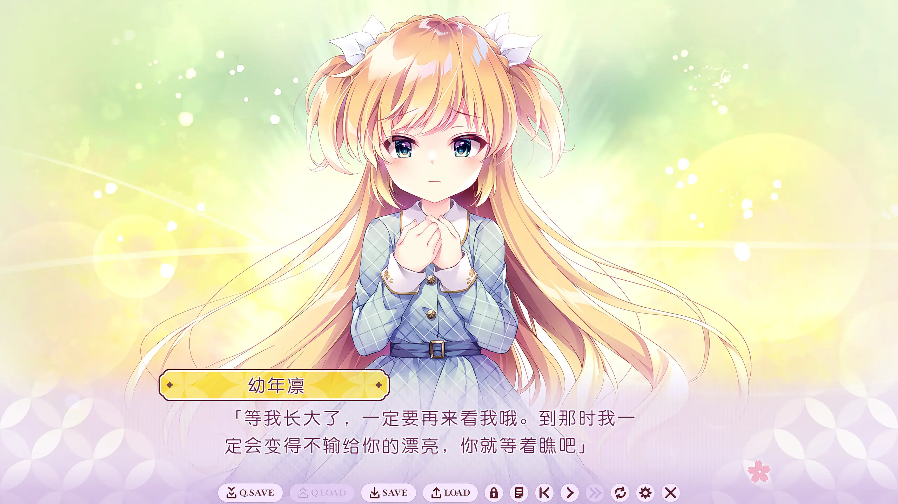

「等我长大了，一定要再来看我哦。到那时我一定会变得不输给你的漂亮，你就等着瞧吧。」

那场演出结束后，小一花见到了精致得像洋娃娃一样的克里斯。他对她讲自己有多热爱歌舞伎、又如何不去理会旁人的流言蜚语——正是这份「能够真正成为自己」的坦荡，让克里斯深受触动。临走前他还撩了人家一把：「等我们再见面，你就嫁给我吧——到时候我一定会变得比你还漂亮。」那一句「你超级漂亮又可爱」，被克里斯一直记到了今天。

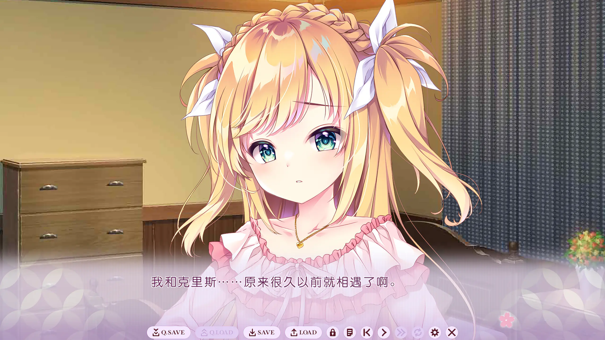

原来克里斯心里那个「早就结束了的歌舞伎」，是她漂洋过海也忘不掉的初遇；原来她在这所女校里争强好胜，骨子里也藏着一个想再见到「一花」的小女孩。当凛把这一切拼凑起来时，那种「我们早在彼此还很小的时候就交换过约定」的宿命感，一下子把两个人之前所有的针锋相对都重新染上了颜色。原来从一开始，他们就不是对手。

## 她喜欢的，是卸下伪装的我

这条线真正打动我的，不是「男主其实是男人」这个反转本身，而是克里斯在知道真相之后的反应。

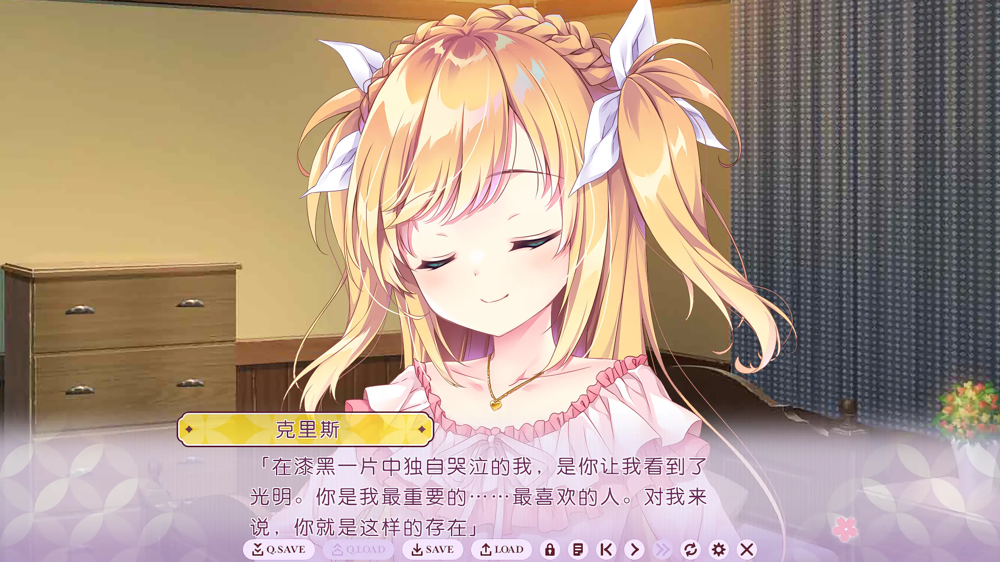

「在漆黑一片中独自哭泣的我，是你让我看到了光明。你是我最重要的……最喜欢的人。对我来说，你就是这样的存在。」

她爱上「藤波凛」的时候，以为对方是个女孩子；如今知道了凛是男人，知道了他就是当年那个「一花」，她喜欢的那个人却一点都没有变。最开始把她从黑暗里拉出来的，和此刻陪在她身边的，本来就是同一个人——藤波凛、山科凛、一花，三个名字，一个灵魂。克里斯爱的从来不是某一层身份。

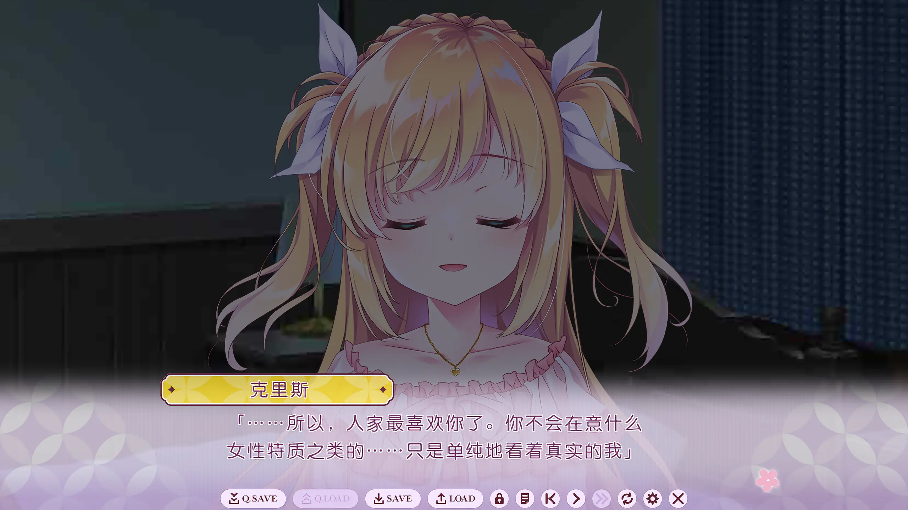

「……所以，人家最喜欢你了。你不会在意什么女性特质之类的……只是单纯地看着真实的我。」

这句话我盯着看了很久。整部作品都在玩「女形」「女装」「理想化的女性」这些层层叠叠的伪装，可到了感情的核心，两个人想要的东西都特别朴素——被一个不在乎你「够不够有女人味」、只是单纯看着真实的你的人喜欢着。克里斯一直被当成那个完美无瑕的「金色王子」，凛却让她可以卸下这层光环；而凛半生都活在「扮演别人」里，克里斯却愿意越过所有伪装，只认那个真实的他。两个在「扮演」里活了太久的人，最后在彼此面前一起卸了装。

## 「嫁给我吧」——脱口而出的真心话

故事接近尾声的一个夜里，克里斯靠着凛睡着了。凛望着她的睡颜，脑海里那段被自己遗忘了太久的童年记忆终于一点点拼了回来——梦里那个身影，原来真的就是克里斯。

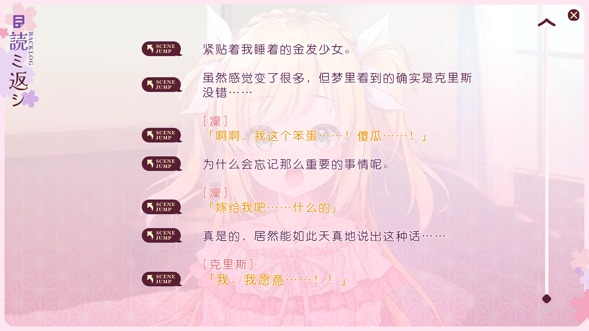

「啊啊，我这个笨蛋……！傻瓜……！为什么会忘记那么重要的事情呢。」懊恼之余，他几乎是自言自语地嘟囔了一句：「……嫁给我吧，什么的。」

他以为克里斯睡着了，没想到——

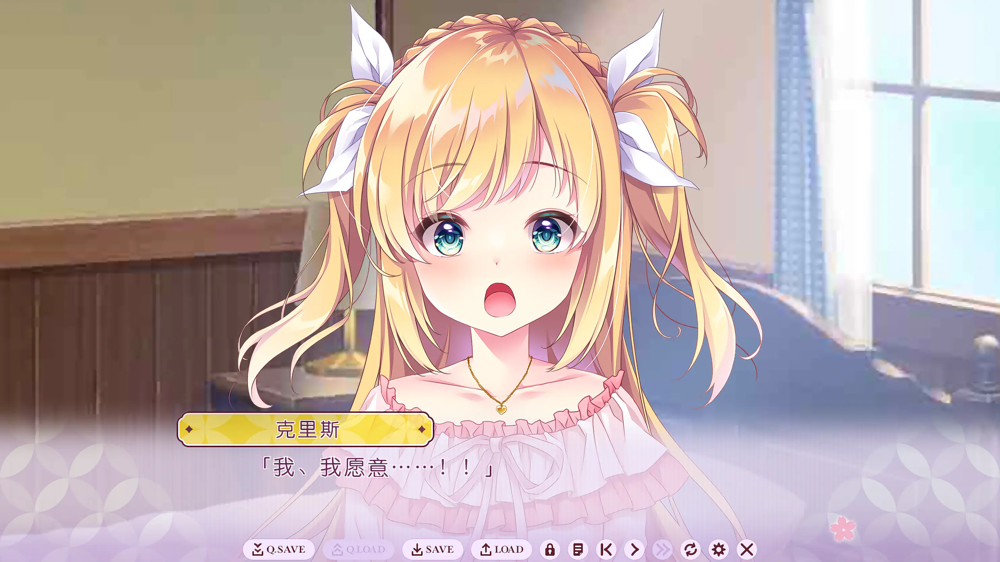

「我、我愿意……！！」

本该熟睡的克里斯猛地弹了起来，答得又快又急。一句半是玩笑、半是真心、几乎不打算让人听见的呓语，就这样被她稳稳接住了。而这声「嫁给我吧」，恰好接上了许多年前那个小一花对她许下的同一句承诺——当年是他先开的口，如今他忘了又记起，仍旧是他先说了出来。一个把求婚说得像在懊恼自己健忘，一个把答应喊得像在抢答，活脱脱就是这两个人一路走来的样子。

## 在舞台上，把真心话当台词说出来

两个人的关系再也藏不住，全校学生干脆一致觉得：撫子之君该由他们俩一起来当。可这又要坏了规矩，于是老师们想出一个折中的法子——让凛和克里斯以一场舞剧定胜负。他们演的是《罗密欧与朱丽叶》：克里斯演罗密欧，凛演朱丽叶，两个相爱却不得不分离的人，恰好映着此刻这所学校的处境。

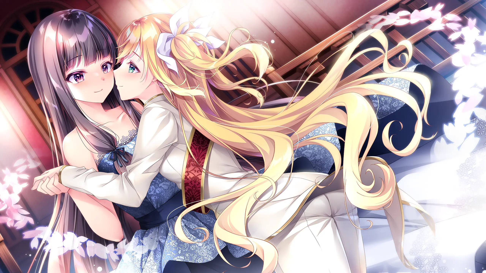

舞台之上两人执剑相向，不知舞了多久，只听「砰」的一声，两柄剑同时碎裂。凛抓住这个间隙，当着满场观众的面，把克里斯拉过来吻了上去。台下尖叫一片——这场半真半假演了许久的戏，终于在舞台中央落回了真心。

台下还坐着两位看得格外出神的人——千波校长和特任教师斯帕克。其实斯帕克也和凛一样，是个把自己藏在伪装下的男人；他与千波之间也横着和风、洋风那道坎，当年甚至试过私奔，却没能成功，此后他便一藏就是许多年，只为留在她身边。看着台上这对终于跨过了他们当年没能跨过的坎，老校长也只是叹了口气：就纵容这一回吧。这条悄悄埋在背景里的暗线，几乎是凛与克里斯的一面镜子——同样的男扮女装，同样被时代的壁垒挡在中间，只是上一代输给了那道坎，而这一次，是年轻人赢了回来。

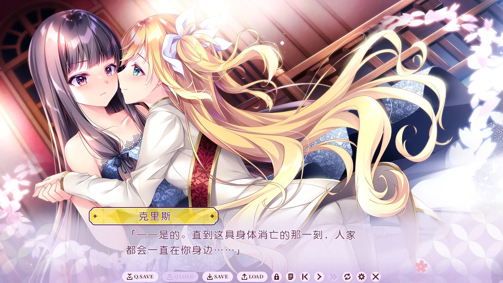

「——是的。直到这具身体消亡的那一刻，人家都会一直在你身边……」

那个曾经讨厌依赖别人、凡事都要逞强的贵族小姐，最后把自己整个交付了出去。后来那场撫子之君的选举，因为太多张写着两个人名字、或干脆空着的废票而无法分出胜负——于是校方索性宣布，凛与克里斯同为第一任撫子之君。两人在讲台上握住彼此的手时，克里斯也早已不再执着于父亲的认可：她最喜欢、也最想得到其认可的那个人，就站在她身边。

## 花期苦短，所以更要起舞

通关之后再回头看标题——「华は短し、踊れよ乙女」，花期苦短，起舞吧少女——会觉得它取得真好。歌舞伎的一场戏会落幕，少女时代的女校生活会结束，连同那身华美的女装、那个金色的王子，终有一天都要谢幕。正因为花期这样短，才更要趁着还开着的时候，尽情地舞上一场——就像凛和克里斯最后在那方舞台上做的那样。

我原本是冲着「男扮女装」的猎奇和那张好看的 CG 来的，却意外地被这条线里那份「无论你披着哪一层身份，我喜欢的都是真实的你」的笃定打动了。克里斯先是以为爱上了一个女孩子，再发现对方是男人、是儿时仰望过的那个「王子」，可她的心意自始至终没有动摇过。对一个把「扮演别人」当作宿命的男主来说，能遇到一个愿意看穿所有伪装、只认那个真实的他的人，大概就是这部短促如花的故事，留给他最长久的东西。
