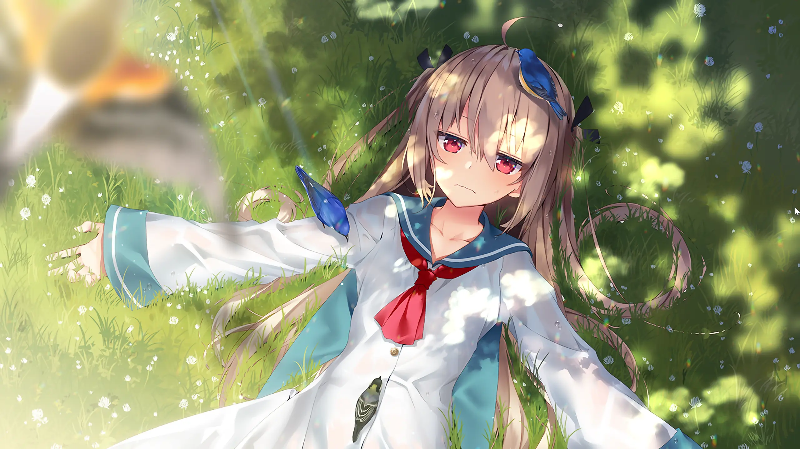

刚看到[《ATRI -My Dear Moments-》](https://vndb.org/v27448)的时候，以为它很好概括：海平面一直涨的未来，一座快要沉进海里的小镇，一个丢了腿也丢了方向的少年，一个从海底沉船里捞上来的机器人少女。

打完之后才发觉，脑子里剩下的不是这些设定。

是一个亮得不真实的夏天。

海水淹上来的废墟、不够用的能源、不知道往哪走的生活、从过去追过来的伤——故事里一样也不缺。可回想的时候，先跳出来的总是树荫、白云，水面上的光。还有亚托莉一把拉住夏生的手，那架势，根本没打算商量。

## 她像夏天一样撞进来

亚托莉出场的时候，夏生连消沉的机会都快没了。她信心满满地宣布自己是"高性能"机器人——会得意，会闹别扭，会把事情搞砸，会用最直接的办法把他从封闭里拽出来。

背景其实压得很沉。文明一点一点被海水吃掉，熟悉的地方再也回不去，留在岛上的人只能在有限的物资和看不清楚未来的日子里活着。夏生的状态和这座小镇挺像——表面还在运转，里面已经不往前走了。

那条义肢从头到尾都在提醒他，身体少了什么。不光是腿。连着事故的创伤，连着他对自己的看法。从都市退回被海水包围的故乡，没有想去的地方，跟别人保持着距离，对明天也没什么期待。冷淡是一种保护——只要不再投入，就不用再面对失去。

亚托莉没有用一句漂亮话把他"治好"。她有时候吵得人头疼。只是不停地闯进他的时间表，把眼前的事情一件件堆到他面前，不给他一直躲在心里的空。

她对什么都来劲，像是只要今天还能往前跑，世界就不会真的结束。

前面那些零碎的日常，是真正让人陷进去的地方。修坏掉的设备，重新走进学校，为供电想办法，再跟大家把一个方案真的做成。每件事都很具体——哪缺材料，机器为什么不转，今晚能不能让灯亮起来。正是这些盯在眼前的小麻烦，让夏生重新用起自己的知识，也重新回到了人跟人之间。

发电这一步特别重要。对岛上的人来说，电不是什么文明的象征——就是晚上有灯，机器能动，孩子能在更像学校的地方上课。夏生做的事情改变不了海平面，也救不了世界。但身边人的明天，确实比昨天好了一点。

废弃学校也不再只是一处末世风景。有人坐进教室，有人吵架偷懒，有人认认真真讨论接下来怎么办。空间没有变回过去的样子，生活倒是重新进来了。岛上的共同体就是这么建起来的——谁也不是救世主，每个人只把自己能做的那一点接上。

亚托莉一直在这些日常里。帮得上忙，也添乱，用自己过于充足的自信把沉闷的地方撞开。夏生一次次被她拉去解决问题，慢慢习惯了被依赖，也习惯了主动去回应别人的期待。他不是哪天突然振作——是在修好一样东西、答应一次请求、再去一次学校的过程里，一点点找回那种"自己还能参与生活"的实感。

亚托莉给他的，没办法只用"爱情"两个字说完。她让他重新相信，身体虽然留下了消不掉的伤，人生没有被那场意外判死刑。还是能解决问题，还是能被人需要，还是能为一个人伸出手。

## "心"不需要考试

游戏一直在问一个问题，不算新鲜：机器人能不能有真正的感情？但 ATRI 没有花力气去给技术证明。

亚托莉的感情可能来自程序，表达可能只是学会了模仿。可她会因为一句话受伤，会珍惜一起过的时间，会在明知道结局改不了的时候自己做选择——到这时候，"真假"已经不太重要了。

中后段把这个难题推得更近。亚托莉怎么理解自己的感情，夏生敢不敢相信她——每一步都在反过来改写两个人的关系。打到这里确实动摇过：如果有些反应能被程序解释，那之前感觉到的快乐和难过，是不是得打个折？

但这层怀疑很快就转回了人类自己身上。人的感情一样被记忆、经历、本能捏出来的。谁也拆不开另一个人的心，验不出里面有没有一份百分之百纯粹的爱。只能看对方说了什么、做了什么、关键时候选了哪一边。如果这些已经够用来理解一个人——凭什么要求亚托莉拿出更严格的证明。

水中的那个吻，力度不来自它终于给关系贴了一张"恋爱"的标签。那一刻，没有人得到关于未来的保证。只是在有限的时间里回应彼此，把掏不出证明的心意，当成真实存在的东西接住了。

亚托莉最靠近"人"的一刻，不是流泪，不是说出喜欢——是她终于有了自己选的能力。不再只执行命令，也不再甘心做谁留下的替代品。知道自己想守着什么，愿意为这个选择付出代价。

夏生也选了一边。他不再追问亚托莉能不能通过一场关于"心"的考试，只是接受了——自己已经被她改变了。相信这件事本身就有风险，尤其离别从第一天就写在这段关系里头。但他还是伸出了手。

## 四十五天为什么这么长

ATRI 篇幅不大，故事里相处的时间也就四十五天。但日子是一天一天过的，没有被压缩成几个决定命运的大事件。

早上要去学校。白天修设备，发愁发电和物资。空下来去海边，跟熟人拌几句嘴，入夜以后看一会儿星星。很多场景单独抽出来都不重，甚至就是几句闹哄哄的对话。但叠在一起，岛上的生活开始有摸得到的纹路。

慢慢能分清这些日子的冷暖。学校里有重新聚集起来的人声。海面近得像是随时会漫上来。发电成功之后的光，让夜晚暂时多了一点安全。岛上每个人都知道环境不会自己好起来，还是会为了明天的课、明天的饭、明天的电去忙。就是这种小范围的认真，让末世没有变成一句空洞的背景设定。

四十五天，比一个数字长多了。夏生和亚托莉一起过的不是什么奇迹——是很多个普通的上午和傍晚。感情落到地上，有了具体的坐标：一间教室，一台修过的机器，沿海的一段路，某次没什么意义却忘不掉的闲聊。

故事从一开始就在提醒你：这两个人的时间，总有一天会用完。正因为不会永远持续下去，这段关系才不是一场能无限读档的美梦——是他们必须认认真真活一遍的现实。

星空下相拥的画面，把这种感觉拉得很长。星星看起来远得近乎永恒，人的四十五天搁在旁边短到可以忽略不计。但对身在其中的两个人来说，这就是可以改写往后全部人生的时间。

通关以后再想标题里的"My Dear Moments"，说的正是那些没法延长、却被认真用完的片刻。留不住一个人，不代表一起活过的日子就没了分量。记忆也许会模糊，但那些日子在里面刻下的改变，已经流进了往后的人生里。

## 明明在下沉，画面却一直在发光

ATRI 的世界正在被海水吞掉，可美术几乎从来不把末世涂成灰的。海面是透亮的蓝，阳光穿过叶子洒下来，废掉的建筑旁边还有植物在长。就连被淹掉的地方，也常常因为水的透明和反光显出一点梦一样的漂亮。

旧世界确实回不来了。夏天照常发生。天会热，水花在阳光下闪闪发亮，海风照样吹起亚托莉的头发。人物活在文明退潮之后的土地上，画面却在不停告诉你：眼前还是有好看的东西。

海水在故事里不只是威胁。它也装记忆。它淹掉故乡，把过去隔在够不着的地方，然后又从深处把沉睡的亚托莉推回夏生身边。白天的海面阔得晃眼。到了夜里，星空和海水把两个人包进大片的安静。同一片海，一边拿走生活，一边送来了一次很短的相遇。

音乐也在维持这种明暗缠在一起的气氛。热闹的时候，旋律让拌嘴和校园生活更轻快。镜头转到海边或者夜空，声音就会退后，给沉默留足空间。它不会一直戳着你说"这里应该感动"——更多时候只是把某个傍晚多留一会儿，让一句没说完的话多停几秒。

快到离别的时候，前面日常里攒下来的旋律和画面会一起回来。那种难过不太尖锐，像是在涨潮——等你注意到，熟悉的风景已经被另一层意思盖住了。海水、阳光、星空、夕阳，不只是换换场景。它们搭出了这四十五天的时间感：从盛夏最亮的那一点出发，一步一步，走进注定的黄昏。

衰退的世界。记忆却是明亮的。悲伤没能遮掉夏天，反倒让每一道光都显得更短。

## 一点遗憾

ATRI 体量不大，不是那种能沿着好

几条线慢慢探索的长篇 Galgame。主线收得紧，情绪清晰，代价是有些转折容易提前猜到。关于未来社会、关于海平面上升的设定刚浮出轮廓，镜头就拉回了夏生和亚托莉。岛上的配角很讨喜，能给他们留的篇幅却不多。

偶尔会想，学校和岛上那几个人再多写几笔就好了，也想看看这个世界的其他人是怎么活的。但这些遗憾没有伤到内核。故事很清楚自己要写哪四十五天，也愿意在该停的地方停下来。从某个角度说，这份短恰恰对上了它的主题——不需要把一切说到滴水不漏。让有限的相处留下够长的回音，就够了。

## 海水在上头，明天还是会来

ATRI 的结尾收得很好。有遗憾，有科幻故事特有的那点浪漫，但没有把角色永远锁在悲伤里。海水淹了旧世界，人还是会找到新的活法。很短的相遇结束之后，被留下来的人会把那段记忆带在身上，接着往下走。

打完很久以后，大概会忘掉不少情节。但有一幕忘不掉——亚托莉在海边跑的样子。裙摆被风掀起来，夏生使劲跟在她后面，夕阳把天空染成一种不太像真的颜色。那个画面像是把整部作品压进了一格：世界不温柔，能一起走的时间也不够长，但只要手还拉着，就该使劲往前跑。

那也是夏生跟开头最不一样的地方。刚出发的时候，他没有方向，不对未来开口。到了最后，腿还是那条腿，要面对的还是失去，但已经知道为什么迈下一步。亚托莉没有替他消掉过去的伤。陪他过的这四十五天，让他重新学会把脚下的路，当成日子来过。

——

不是关于永远。

关于短暂的东西，为什么值得被一直记得。
