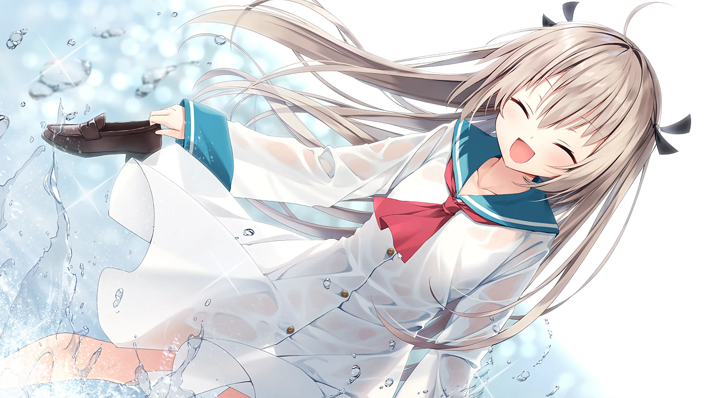
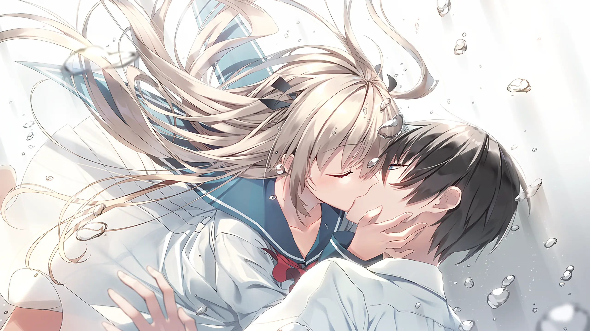
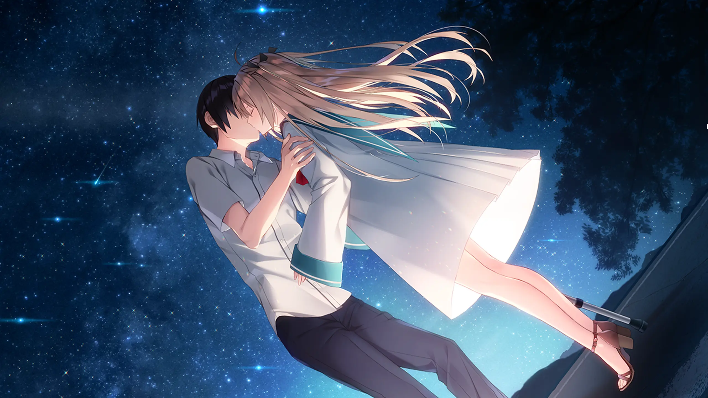
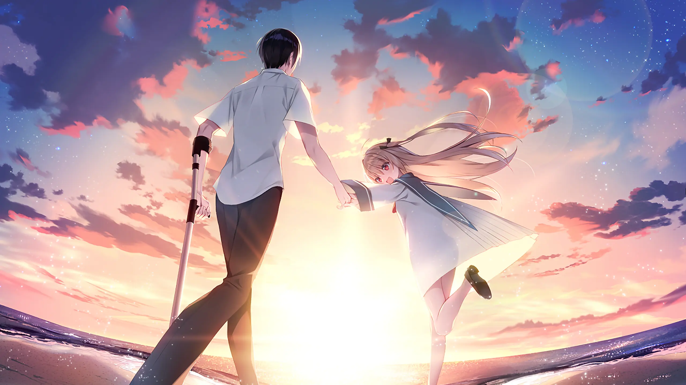

初看[《ATRI -My Dear Moments-》](https://vndb.org/v27448)，很容易把它概括成几句话：海平面持续上涨的近未来，一座正在沉入海中的小镇，一个失去左腿也失去方向的少年，一个从海底沉船里打捞上来的机器人少女。

通关之后，脑子里剩下的却不是这些。

是一个夏天，亮得不太真实。

被海水吞咽的废墟、永远短缺的能源、看不清前路的生活、从过去一路追来的伤痛——故事里一样不少。但回想的时候，最先浮起来的总是树荫和白云，碎在水面上的光。还有亚托莉拉住夏生的那只手——没有商量的余地，也没有拒绝的可能。

## 她像夏天一样撞进来

亚托莉登场的时候，夏生几乎失去了所有。他回到被海水围困的故乡，拖着一条义肢，不愿与人来往，对未来闭口不提。冷淡是他唯一的盔甲——不再投入，就不会再失去。

亚托莉没有试图说服他。她只是闯进他的生活，把一桩又一桩眼前的事推到他面前：修理坏掉的设备，想办法让学校重新亮起灯，为一个发电方案四处奔走。她对自己的美貌和性能有着毫不动摇的信心，对人间常识却几乎一无所知，常常把荒唐的话说得理直气壮。但这种不自知的莽撞，恰好撞碎了夏生砌好的那道墙。

发电这一步格外重要。对岛上的人来说，电不是抽象的文明象征——是夜晚能有灯光，设备能重新运转，孩子们能在更像教室的地方上课。夏生做的事改变不了海平面的走向，也救不了整个世界。但身边人的明天，确实比昨天明亮了一点。

亚托莉始终在这些细碎的日常里。她不是某一天用一句漂亮话把他治好的。她只是让他在修好一件东西、答应一次请求、再去一次学校的间隙里，一点一点把"自己还能参与生活"的实感捡了回来。他慢慢习惯了被依赖，也习惯了回应别人的期待。从封闭到重新伸出手，中间没有戏剧性的转折——是无数个不起眼的瞬间堆叠起来的位移。

## "心"不需要合格证

ATRI 从头到尾都在追问：机器人能否拥有真正的感情。但它没有把力气花在技术论证上。

亚托莉的感情也许源于程序，她的表达也许只是学会了模仿。可当她因为一句话而受伤，当她在明知结局无法更改时仍做出自己的选择，"真假"的边界便开始融化。打到中后段，我确实动摇过：如果某些反应可以用程序拆解，此前感受到的快乐和难过，是否应该因此打折。

但这层疑虑很快回到了人类自身。人的感情同样被记忆、经历和本能层层塑造。没有人能拆开另一个人的胸口，验出里面是否装着纯粹的爱。我们只能看对方说了什么、做了什么、在关键时刻选了哪一边。如果这些已足够用来理解一个人——凭什么要求亚托莉交出更苛刻的证明。

水中的吻不像是盖章，更像是交托。那一刻，谁也没有得到关于未来的保证。只是在有限的时间里回应了彼此，把掏不出证据的心意当作真实存在的东西接住了。

亚托莉最接

近"人"的瞬间，不是流泪，不是说出喜欢。是她终于拥有了自己选择的能力——不再只执行命令，不再甘心做谁的替代品。她知道自己想守住什么，也愿意承担选择带来的代价。夏生同样做出选择。他不再追问她能否通过一场关于"心"的考试，只是接受了：自己已经被她改变。相信本就意味着风险，而离别从第一天就写在这段关系里。但他还是伸出了手。

## 四十五天为什么那么长

ATRI 的体量不大，故事里的相处只有短短四十五天。日子是一天一天过的，没有压缩成几个大事件。

早上出门去学校，白天修设备、愁发电和物资。空了去海边，被熟人拌几句嘴。晚上抬头看一阵星星。这些场景单拎出来都轻飘飘的，叠在一起，却让岛上的生活有了可以触摸的纹理。慢慢能分辨这些日子的冷和暖——学校里有重新聚集起来的人声，海面近得像是随时会漫过脚背，发电成功后亮起的灯让夜晚多了一层薄薄的安全感。

岛上每个人都知道环境不会自己好转，却还是会为了明天的课、明天的饭、明天的电去忙。就是这种小范围的认真，让末世没有沦为空洞的布景。

故事从一开始就告诉你：他们的时间终会用完。正因如此，这段关系才不是一场可以无限读档的美梦——是他们必须认认真真活一遍的现实。头顶的星星看着近乎永恒，四十几天搁在旁边短到可以忽略不计。但对身在其中的两个人来说，这就是足以改写余生的全部。

通关之后再想标题里的"My Dear Moments"，说的正是那些无法延长、却被认真用尽的片刻。留不住一个人，不等于一起活过的日子就没有分量。记忆也许会模糊，但那些日子在身体里刻下的改变，已经静静流入了往后的人生。

## 海水里也有光

ATRI 的世界明明在下沉，美术却几乎不把它涂成灰的。海面是透亮的蓝，阳光穿过叶子落下来，废弃建筑旁还有植物在长。淹掉的地方因为水的透明和反光，常常显得像梦一样不真实。旧世界确实回不来了，夏天却照常发生——天还是会热，水花还是在阳光下发亮，海风还是照样吹动亚托莉的头发。

海水在故事里不止是威胁。它淹没故乡，把过往隔在深不见底的地方，然后又把沉睡的亚托莉送回夏生身边。同一片海，夺走生活，也送来一次很短的相遇。

音乐很少刻意煽情。热闹时，旋律托住拌嘴和校园日常。转到海边或星空时，声音退得很轻，给沉默留足余地。它只是把某个傍晚多留一小会儿，让一句没来得及说完的话多停几秒。

快到离别的时候，前面攒下来的音符和画面一齐涌回来。那种难过不尖锐——像涨潮。等你回过神来，熟悉的风景已经被另一层意思覆盖了。衰退中的世界，可我的记忆始终是明亮的。悲伤没能遮住夏天，反而让光显得更短。

## 一点遗憾

ATRI 的体量让它只能收拢主线，无法像长篇 Galgame 那样沿着多条路线慢慢铺开。情绪清晰，代价是一些转折来得太容易预料。关于未来社会的设定刚浮出轮廓，镜头便拉回了两个人的身上。岛上的配角都很讨人喜欢，留给他们的篇幅却太少。

但这份短也恰好对上了它的主题——不需要把一切说到滴水不漏。让有限的相处留下足够长的回音，就够了。

## 海水在上头，明天还是会来

结尾收得干净。有遗憾，也有科幻特有的浪漫，却没有把谁永远锁在悲伤里。海水淹了旧世界，人还是找到了新的活法。很短的相遇结束之后，被留下的人把那段记忆带在身上，继续往前走。

有一幕我大概很久都不会忘。亚托莉在海边跑，裙摆被风掀起来，夕阳把天空染成一种不像真的颜色。夏生跟着她，那条腿还是出发时的那条，要面对的还是失去，但他已经知道自己为什么迈下一步。亚托莉没有替他抹掉过去的伤，陪他过的这四十五天，只是让他重新学会了把脚下的路当作日子来过。

——

不是关于永恒。是关于短暂之物，为何值得被长久地记住。
