我的第一部视觉小说，是 2024 年 2 月 27 日下午点开的。

那天之前，"galgame""视觉小说"对我来说还只是一个模糊的标签，是别人口中"看字的游戏"，我并不清楚它和一本电子小说、一段动画有什么区别。直到画面亮起来，背景音乐淌进来，第一行字停在那里等我自己点下去——我才意识到，原来"读"也可以是一件需要亲手参与的事。

点开的这部，是[白露社](https://vndb.org/p8966)的《寄甡》。我后来才知道，这是一整个系列的起点。白露社把旗下这几部百合作品放在同一所虚构的"聆花女子学院"里，时间线彼此相连，又把英文副标题都落在同一个词上——*Symbiotic Love*、*Melancholy Love*、*Eternal Love*、*Unwavering Love*，共生、忧郁、永恒、不渝，四种"Love"，对应《寄甡》《千面》《夜永》《南栀》四部。

我那三天做的事情，就是从第一个词，一路读到了第四个词。

## 寄甡 · Symbiotic Love：看似甜恋，底下却埋着悲剧

2024-02-27 下午，故事从聆花学院的花园开始。

《寄甡》的两个主角性格几乎相反。**紫娑**来自一个普通的单亲家庭，母亲常年卧病，她一边念书一边把生活扛在肩上，人却开朗，成绩也好；**梓婳**恰恰相反，出身富贵、外冷内热，身后却站着一个控制欲极强、近乎严苛的母亲——把她牢牢圈在身边，不许她和任何人来往，认定所有靠近她的人都别有所图。

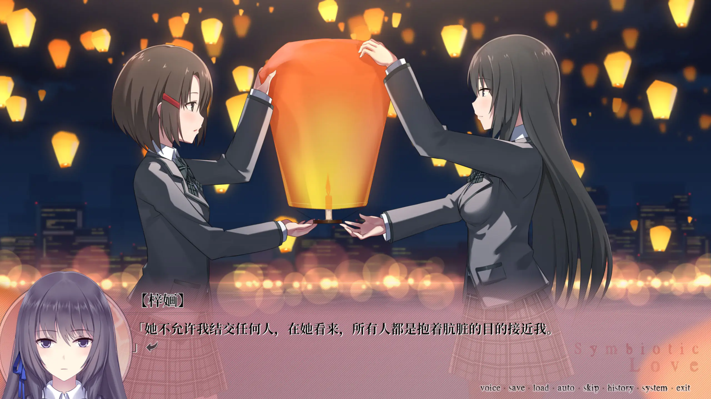

就是在这样的家庭阴影里，紫娑一点点把梓婳从壳中拉了出来，两个人的情谊越过友情，慢慢化成了恋意。雨夜的花园里梓婳受了惊，一头扎进突然冒出来的紫娑怀里；中秋灯会上她们并肩看节目，把一盏孔明灯一起托上夜空，然后是十指相扣。

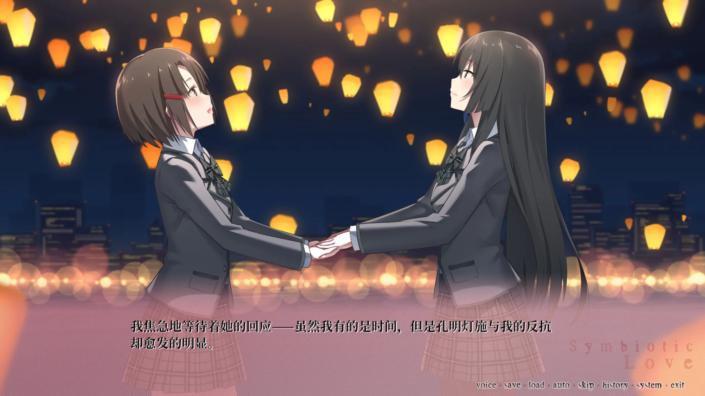

后来紫娑感冒高烧、烧得迷糊时，反倒把一直藏着的心意全说了出来，梓婳也大大方方地正面回应。那阵子连分吃一根抹茶巧克力棒都是甜的。

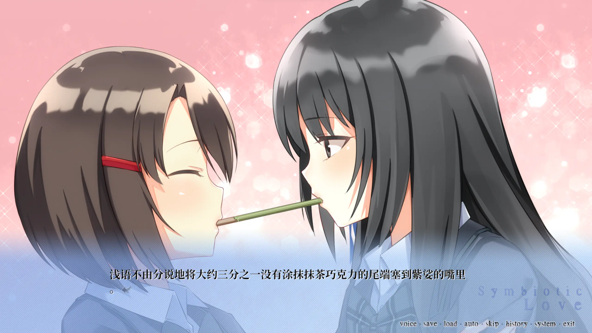

可副标题"共生之爱"从来不只是甜——它骨子里是一出**现代百合版的《罗密欧与朱丽叶》**。圣诞前后，真相像炸弹一样引爆：紫娑与梓婳竟是**同父异母的姐妹**（同一个父亲，紫娑是父亲与前一任伴侣所生、年纪稍长，梓婳则是父亲与现任妻子所生）；而更残忍的是，紫娑母亲的死，正是梓婳母亲一手造成。横在两人之间的，不只是罗密欧与朱丽叶那样的门第之别，还有血缘的禁忌和上一代的血仇。

那个意识渐渐流失的瞬间，大概是整部作品里最沉的一格画面：

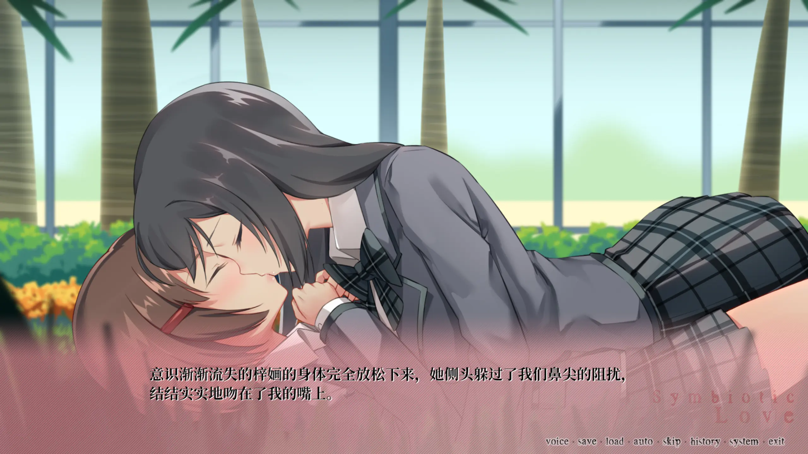

"意识渐渐流失的梓婳的身体完全放松下来，她侧头躲过我鼻尖的阻挠，结结实实地吻了我。"——明明是吻，却更像诀别。命运已经把她们逼到了尽头，而她们能做的，只剩在彻底失去对方之前，把这一个吻结结实实地交出去。

《寄甡》一共五个结局，全部以"花"命名：双生之花、狂乱之花、殉爱之花、轮回之花、寄生之花。多数走向都是悲剧——紫娑以最极端的方式向不公的命运作了抗争，梓婳则几乎都落得精神失常。唯有真结局"双生之花"留了一线极淡的希望：也许紫娑并没有真的死去，只是远走他乡、种下满地彼岸花，等着有朝一日与梓婳重逢。彼岸花正是贯穿全篇的意象——花开不见叶，叶生不见花，思念彼此却注定难以相见。

这游戏连名字都藏着刀：两位主角"紫娑梓婳"连读谐音"自说自话"，而标题里那个生僻的"甡"字，写出来几乎就是两个"死"字并立。

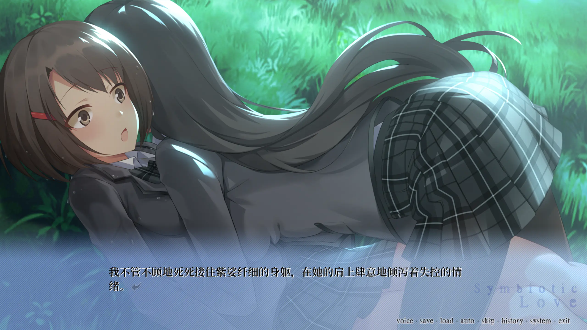

回头再看开头那片草地上"死死攥住纤细的身躯、在肩上肆意倾泻失控情绪"的拥抱，才明白那并不是热恋的腻歪，而是已经预感到终将失去时、近乎绝望的死命抓紧。把这样一部彼岸花底色的悲剧选作人生第一部视觉小说，现在想想也挺猛——但也正是它，让我第一次真切体会到文字、立绘和配音叠在一起、再由自己亲手点开时，那种和读小说、看动画都不一样的分量。

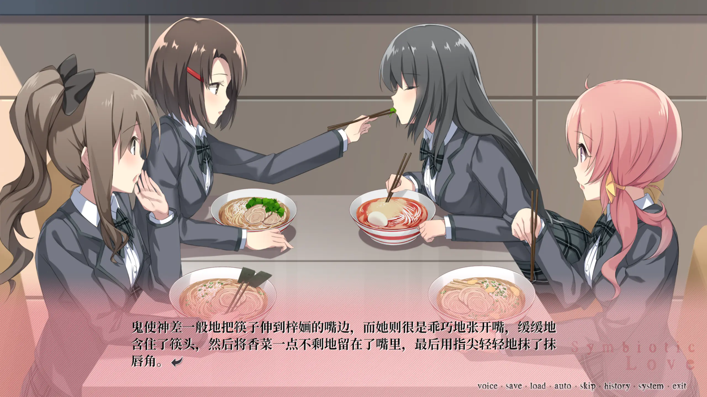

对了，还有浅语，画面右边那个粉头发的女孩。她戏份不多，性子却活泼抢眼，是我在这部沉重作品里一眼就喜欢上的一抹亮色。当时我还不知道，这几乎是我在整个系列里见到她的、为数不多的几面——这是后话了。

## 千面 · Melancholy Love：十年之后，最甜的一部

第二天，2024-02-28，我接着点开了《千面》。

它的时间线设在《寄甡》**十年之后**的聆花学院，而当年的梓婳，此时已是这所学院的校长——系列就这样把上一代和下一代接了起来。这一部讲的是一对新人：被贴上"不良差生"标签、其实心地善良的**眠雪**，和看似乖巧、内心却渴望自由的优等生班长**千寻**。

标题"千面"既是"千寻"与"眠雪"两个名字的合体，也点出了主题——每个人都有不为人知的另一面。千寻总爱去找眠雪的麻烦，实际上是被她身上那份自由不羁吸引、暗暗向往。问题是，千寻太怕真实的自己不被接受，于是在眠雪面前，她谎称那个快活不羁的自己，是"自己的双胞胎姐姐"。

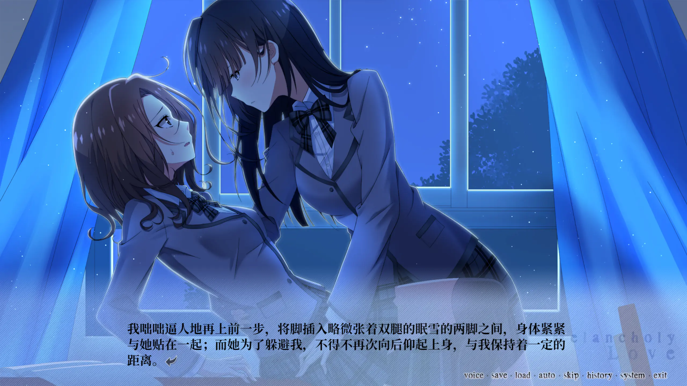

于是眠雪爱上的，其实是千寻一直藏着的真实模样，而千寻却把这一面挂在了一个并不存在的"姐姐"身上。"也许，不管我作何回答，她都不会满意"这种患得患失，正是这部的底色——它的英文副标题是"忧郁之爱"，可那忧郁不是绝望，而是恋爱本身自带的、怕被拆穿又渴望被看见的那点心慌。

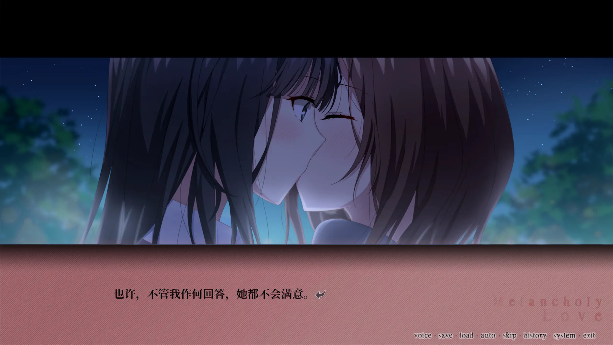

真结局"千层雪"是 HE：千寻的双重身份因为眠雪的一个恶作剧意外暴露，她最后请求"再做一天朋友"，两个人终于鼓起勇气面对真心、解开误会，走到了一起。（另外两个结局"夜来香""勿忘我"则通向 BE。）也正因为它把心动里那些最让人发痒的瞬间——靠近、躲闪、欲言又止、终于坦白——一个个慢慢铺开，《千面》成了整个系列里我心目中**最甜的一部**。读完《寄甡》那场悲剧之后，它像是被允许好好地甜一场。

## 夜永 · Eternal Love：昙花与茧，平稳的一部

到 2024-02-29，我开始读系列第三部《夜永》。

它接在《千面》**半年之后**，主角换成了在前作就登过场的**秋苓**。这一部的主题落在"昙花"与"茧"上：讲两个各自把一段初恋藏在心里、像作茧自缚一样困住自己的女孩，如何放下过去、转而彼此相爱。"在静谧的夜色下，我甚至都能隐约听到自己心脏剧烈跳动的声音，伴随着在体内飞速奔涌的血液"——这种夜里心跳被无限放大的描写，单拎出来其实很细腻。

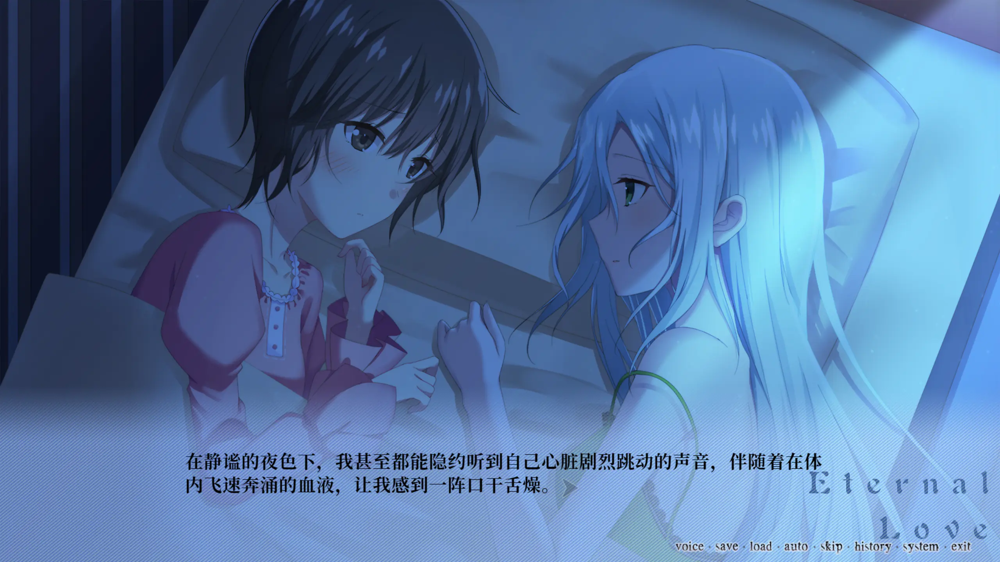

《夜永》是这四部里给我印象最淡的一部。它的结局并不刀，糖分甚至很足，三代主角还会同框发糖，氛围温柔。但也许正因为太平稳——两个人好感的累积不太直观，到结尾前的"CP感"也来得偏慢——它没能像前两部那样狠狠抓住我。把四部连着读完，《夜永》大概就是那块承上启下、却没能盖过邻居的拼图：它把"永恒"放进了标题，故事本身却更像一段安静的过渡。这未必是缺点，只是它站在更亮的两部之间，显得平平无奇。

## 南栀 · Unwavering Love：我恰好在追上它的那天，等到了它

然后是这趟旅程里最幸运的一件事。

我读完《寄甡》《千面》《夜永》三部前作，正是 2024 年 2 月 29 日。而系列第四部、当时的最新作《南栀》，发布日期恰恰就是 **2024-02-29**——我用三天一路追赶，竟然不偏不倚地在它发布当天追上了它。前作的余温还没散，新作就接到了手里。

《南栀》接在《夜永》**一年半之后**。它最打动我的，是把镜头重新对回了系列最初的那对人：**紫娑与梓婳**。在《寄甡》那场令人意难平的别离之后，这一部借着 Luna 交换归来、把人重新带回国的契机，让紫娑与梓婳时隔多年再次相见，去重新决定两个人关系的走向。这场"略带遗憾、又满怀歉意"的重逢，几乎像是兑现了《寄甡》真结局埋下的那点渺茫希望——当年那个种下满地彼岸花、独自等待的人，到底还是等到了重逢。

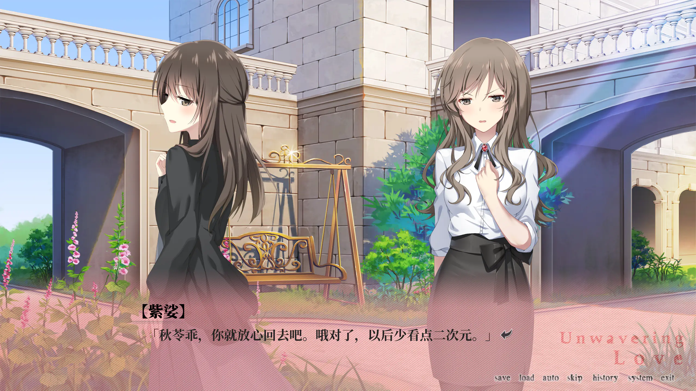

我很喜欢它那种把伤感裹进玩笑里的笔触，比如那句"乖，你就放心回去吧。哦对了，以后少看点二次元"——明明在说离别，却用这么家常、这么调皮的方式说出来，反而更让人鼻酸。而真正把我击中的，是这一句：

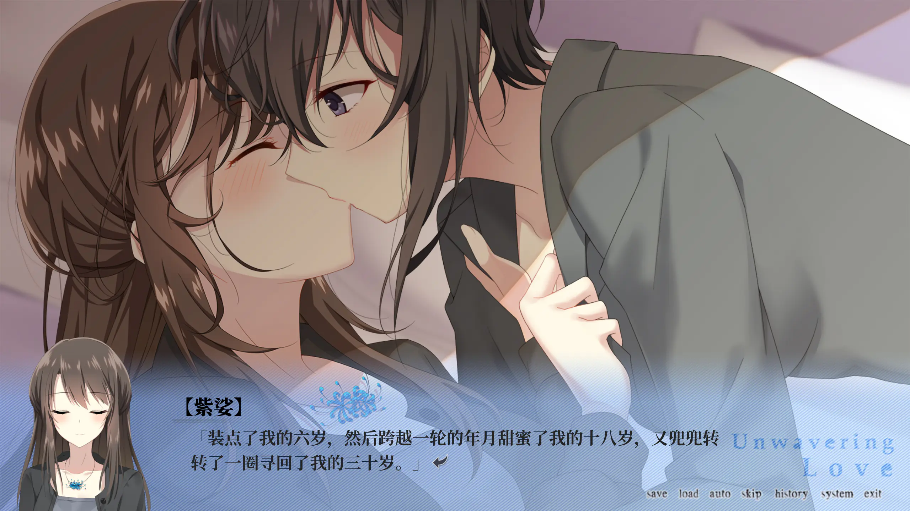

"装点了我的六岁，然后跨越一轮的年月甜蜜了我的十八岁，又兜兜转转转了一圈寻回了我的三十岁。"

六岁、十八岁、三十岁——一个人的大半生，被这份感情串了起来。副标题"不渝之爱"在这里有了重量：它不像《寄甡》那样浓烈到失控，也不像《千面》那样甜得发烫，而是把时间拉得很长很长，长到足以证明"无论隔多久，都会再把彼此找回来"。作为四部曲的收尾，《南栀》给了这个系列一个非常温柔的落点。

## 一点私心的遗憾：再没见到浅语

四部读完，剧情上的意难平之外，我还藏着一个很私人的遗憾——直到《南栀》收尾，我都没能再见到**浅语**。

她是《寄甡》里那个粉头发的女孩，戏份不多，却在我心里留下了格外鲜亮的印象。我本来一直暗暗期待，后面三部既然共用同一所聆花学院、时间线又接连不断，总该让她以某种方式再露个面吧。可一部接一部读下去，新的主角来了又走，学院里的人换了一茬又一茬，那个粉毛却始终没有再出现。

这当然怪不得作品——一个系列没法把每个让人喜欢的配角都安顿好。但作为读者，这种"她明明还在这个世界里，却再也没出场"的空缺，反而比剧情里的悲剧更让人惦记。也算是这趟旅程留给我的一点小小的、没法填上的遗憾。

## 写在最后

回头看，2024 年那个二月底的三天，对我而言其实是两件事同时发生：我读完了白露社的聆花百合系列四部曲，也读完了我人生中的第一批视觉小说。

是《寄甡》用一场彼岸花般的悲剧，让我第一次知道这个媒介能有多重；是《千面》让我尝到它能有多甜；是《夜永》让我明白一个系列里也会有相对平淡的一环；而《南栀》用一个发布当天的巧合，外加一场迟到多年的重逢，给这段入坑经历画上了一个几乎像是安排好的句号。

四种"Love"读下来，我大概也算正式踏进了视觉小说的门。从那之后，再点开一部新的 galgame，对我来说就不再是"看字"，而是又一次愿意亲手参与的相遇。
