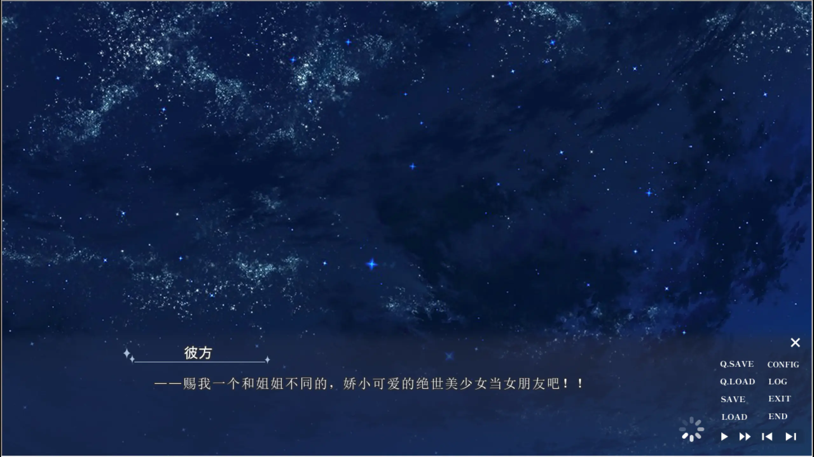
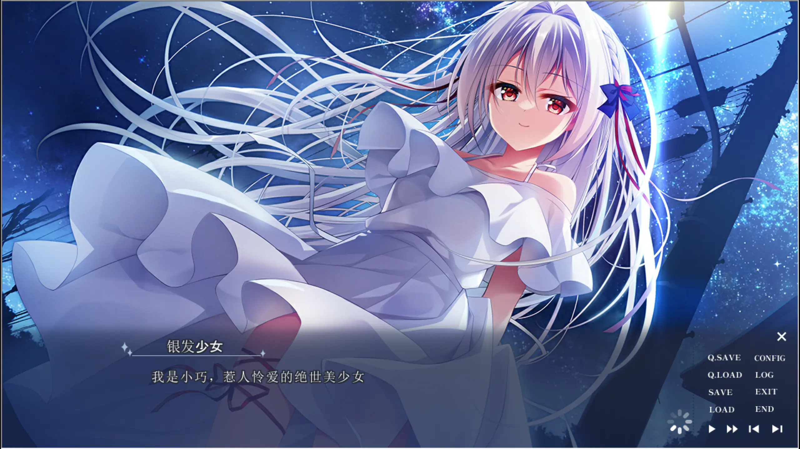
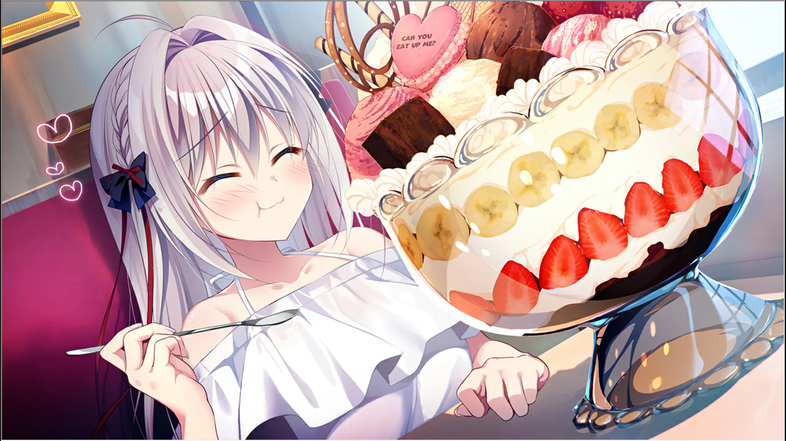
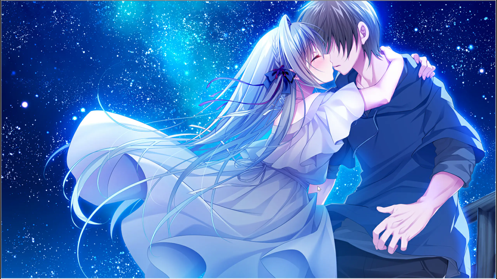
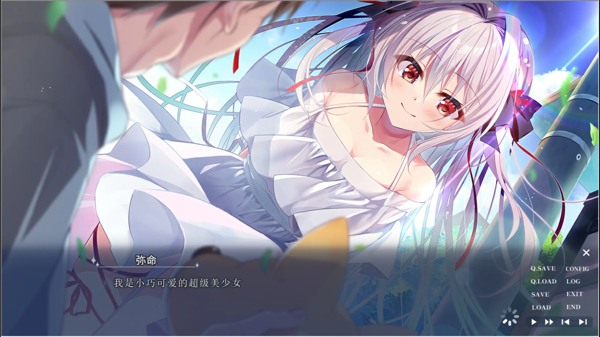
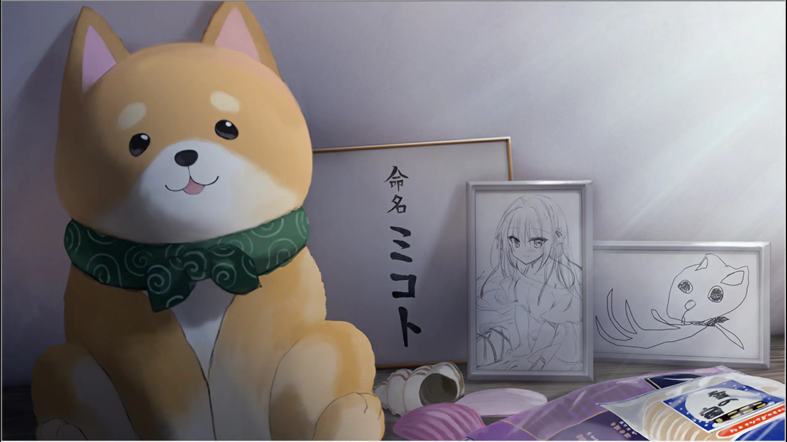
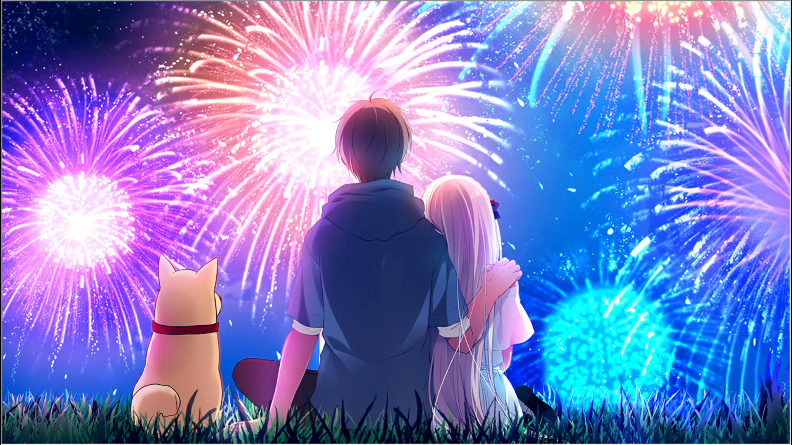

[《流星 -a wish star-》](https://vndb.org/v51298)的开场，像是把一个非常典型的 Galgame 愿望直接扔到了男主角见星彼方面前。

彼方向流星许愿，希望出现一个与姐姐不同的、娇小可爱的绝世美少女做自己的女朋友。然后在暑假开始前那个闷热的夜晚，一位银发少女真的出现了。她自称弥命，也自称“神明”，开口便告诉彼方：“我是来成为你女朋友的。”

愿望实现得太快，反而显得可疑。正常的恋爱应该从相识开始，经历试探、靠近与确认；弥命却像跳过了所有步骤，理直气壮地把自己放进彼方的生活。她不懂人间常识，对自己的美貌有着毫不动摇的信心，胃口又大得与娇小体型完全不相称。无论怎么看，她都更接近一场从天而降的麻烦。

可通关以后再回头看，我发现这部作品真正想写的不是“愿望突然成真”有多幸运。

它写的是：当一个不属于人间的存在，因为某个愿望来到这里，她会怎样在吃饭、出门、帮助别人和相互陪伴的日子中，慢慢拥有自己的愿望；而那个随口向流星索要女朋友的少年，又要到什么时候才能明白，喜欢一个人并不是获得神明赐予的奖品。

## 从天而降的“绝世美少女”

弥命给人的第一印象非常强烈。

银白色长发、红色眼睛、洁白的裙子，再加上夜空与星光，她的造型几乎把“非人的美少女”几个字直接写在了画面里。她确实漂亮，也非常清楚自己漂亮。每当弥命一本正经地强调自己是“小巧、惹人怜爱的绝世美少女”时，我都会觉得她不像高高在上的神，反而像一个刚学会几个夸奖词，便迫不及待全部用在自己身上的孩子。

这种自恋并不令人讨厌，因为弥命的言行里没有精明的算计。她对人类社会的理解大多来自有限的知识与先入为主的想象，于是经常以极其肯定的语气说出荒唐的话。她不是故意装傻，也不是通过卖萌来控制气氛，她是真的不知道。

彼方因此必须不断替她解释常识，阻止她把事情越做越离谱。两人的关系在形式上从一开始就是“男女朋友”，相处方式却更接近临时监护人与刚来到世界上的新人。弥命直线前进，彼方负责收拾；弥命把“恋人应该做的事”当作任务，彼方则要告诉她，人类的感情没有那么简单。

这一点让作品前半段很好入口。它没有花太多时间制造误会，也没有让两个人在暧昧期反复拉扯。弥命的好感从开场便摆在桌面上，故事的悬念不是“她喜不喜欢彼方”，而是这份毫无保留的亲近究竟来自哪里，又会不会在共同生活里变成真正属于她的感情。

当然，弥命最有说服力的个性，可能还是能吃。

巨大甜点摆到眼前时，她脸上的满足几乎比面对彼方还要直白。作品多次用吃东西表现弥命对人间的兴趣，我很喜欢这个选择。食欲既不神圣，也不浪漫，却是最具体的生命感。一个刚来到世上的“神明”，最先迷恋的并非宏大的使命，而是甜味、饱腹感以及和喜欢的人坐在同一张桌边。

这也让她之后对日常的留恋更自然。弥命不是因为读过人类关于幸福的定义，才决定珍惜生活。她先真正尝到了好吃的东西，吹过夏夜的风，看过海，和别人一起笑，然后才明白这些看似普通的事情原来会让人舍不得。

## 愿望并不等于爱情

彼方最初的愿望有点孩子气。他拥有优秀的外表与能力，习惯照顾自由散漫的姐姐见星明，却把自己的恋爱期待浓缩成了“娇小可爱的美少女”。那更像一个符合偏好的角色模板，而不是一个有喜怒、欲望和选择的人。

弥命的出现精准回应了模板。她娇小、漂亮、主动，甚至在见面的第一晚就宣告要成为彼方的女朋友。从表面看，彼方什么都不必付出，理想中的恋人已经被送到家门口。

但《流星》没有把这种便利当作恋爱的终点。恰恰相反，故事要彼方重新认识眼前的少女。他需要知道弥命爱吃什么，为什么喜欢狗，面对陌生事物时会作出怎样的反应；也要逐渐看见她夸张自信背后的天真，以及那份天真终究会被离别和无能为力刺痛。

喷泉旁的弥命已经不只是“许愿得到的美少女”。她有了玩家能够辨认的表情、习惯与节奏。看她笑的时候，我不再只是觉得角色画得好看，而会想到此前那些吵闹的对话，想到她怎样认真误解一句普通的话，又怎样毫无防备地相信彼方。

爱情发生在愿望实现之后。这是我觉得作品最有意思的地方。

流星可以把两个人放到一起，却不能替他们完成相处。它可以送来一个符合审美的女孩，却无法保证彼方真正理解她。弥命最初也只是因为自身来历与目标靠近彼方，她同样需要在日常里确认：想留在彼方身边，究竟是因为自己应当这样做，还是因为她已经无法接受没有他的生活。

于是，两个人的感情看似从百分之百好感开始，实际仍然从零开始。他们省略的是传统恋爱路线中的戒备，无法省略的是让一个抽象愿望变成具体之人的过程。

## 神明开始向人间许愿

弥命在神社合掌的画面，是我很喜欢的一张 CG。

她自称神明，照理说应该是倾听愿望的一方，现在却像普通人一样闭上眼，认真把手合在胸前。身份在这个瞬间发生了微妙的倒转：赐予奇迹的人，也有了无法凭自己的力量实现的愿望。

我觉得弥命真正变得接近人类，不是因为她学会了多少常识，而是因为她开始有所求，也开始害怕失去。

一个什么都能做到、什么都不会失去的神，很难理解人的感情。愿望之所以珍贵，正因为现实可能拒绝它。希望明天仍能一起吃饭，是因为明天未必能够照常到来；希望喜欢的人幸福，是因为自己可能无法一直陪伴；希望这个夏天不要结束，是因为季节从来不会为谁停下。

弥命最初说话总是充满确定性。她确定自己可爱，确定自己是彼方的女朋友，也仿佛确定所有麻烦都能用神明的方式解决。但随着故事向后推进，确定逐渐让位于迟疑。她第一次品尝依恋，也第一次面对仅凭善意无法解决的痛苦。那种无能为力对一个“神明”而言尤其残酷。

作品的核心冲突因此并不复杂，却足够直接：一个因愿望而来的女孩，能否拥有不受最初使命规定的人生？她对彼方的爱，究竟是愿望的一部分，还是共同度过的时间真正留给她的东西？

星空下的吻给出了最直观的回答。

这张画面把弥命的非人感推到了最漂亮的位置。她的银发与白裙几乎融进星河，仿佛下一秒便会化作光消失；可她抱住彼方的动作又非常用力。她不再只是从夜空降落到他身边，而是在明知时间有限时，主动抓住了一个人。

前者是奇迹，后者才是选择。

## 夏天的意义藏在无用的小事里

《流星》是一部体量不大的单线作品。按照 VNDB 的统计，通常只需四小时左右便能读完。它没有庞大的世界观，也没有多位女主角之间复杂的路线分歧，绝大多数篇幅都围绕彼方、弥命、姐姐明与小狗拉芙展开。

这种规模让作品很像一本轻薄的夏日短篇。弥命来到家中，大家一起生活；出门帮助遇到困难的人，去海边玩，在街上吃东西，再从白天走到星空与烟火升起的夜晚。单独看其中任何一件事，都算不上足以改变命运的大事件。

泳装回、巨大甜点和外出约会都带着很明显的服务玩家意味，作品也从不掩饰自己想让弥命显得可爱。可这些桥段并非完全游离于主线。对弥命而言，它们正是她认识人间的方式。

人为什么喜欢夏天？并不是因为夏天承担了某项功能。只是水很凉，阳光很亮，冰凉的甜品在热天格外好吃，到了晚上还可能看见烟火。所谓日常，本来就由许多没有宏大意义的快乐组成。

弥命越享受这些小事，故事后半段的眼泪便越有重量。她舍不得的并非一个抽象的“人类世界”，而是已经具体到味道、声音和某个人体温的生活。她知道彼方会怎样吐槽自己，也知道明看似随意的态度里藏着怎样的关心；她甚至和拉芙建立了不需要语言解释的亲近。

这些关系令她不再是突然出现、完成愿望后便可离开的过客。

我很喜欢她总把“美少女”挂在嘴边。到了后面，那已经不只是重复使用的人设笑点。每一次自夸都像她在确认自己的存在：我叫弥命，我是漂亮的女孩，我喜欢这些东西，也喜欢眼前这个人。她通过幼稚而坚定的自我介绍，从一个被愿望召来的角色，慢慢成为了有自我认知的人。

## 姐姐、拉芙与故事里另一种爱

如果《流星》只有彼方与弥命，它大概会是一部更纯粹、也更单薄的发糖短篇。见星明与拉芙的存在，把“爱一个人意味着什么”推到了恋爱之外。

明是彼方的姐姐，也是这个家原本的中心。彼方擅长照顾人，很大程度上正因为他一直在照顾随性、不太让人省心的姐姐。两人会互相吐槽，距离近得让旁人误会彼方是姐控，但这种亲密并不是为了制造暧昧。它让玩家看见，在弥命出现以前，彼方已经知道怎样为重要的人付出，只是他未必能坦率面对付出背后的恐惧。

拉芙则把感情拉到更简单的层面。它不会解释神明与人类的区别，也不会追问弥命来到这里的理由。喜欢便靠近，想陪伴便待在身边。弥命喜欢狗，或许也因为动物不会要求她先证明自己是什么。

当故事让告别真正发生，这些此前负责热闹气氛的关系忽然显出另一面。留下的玩偶、画和命名纸，比一段刻意煽情的独白更让我难受。死亡与离别会把活生生的存在压缩成物品：摸过的东西还在，熟悉的声音却不会再次响起。

弥命在此真正理解了“希望一直在一起”为什么会成为愿望。并不是说出这句话便能抵抗时间，而是人在知道无法抵抗时，仍会如此期望。

这种认识也改变了她对彼方的爱。刚出现时，她把成为女朋友当成既定事项；到后面，她终于明白恋人关系包含失去的可能。越是喜欢，离开时越痛。可她没有因为痛苦否定此前的相遇，也没有得出“不曾拥有就不会失去”的结论。

这使作品后半段最动人的部分不是设定揭晓本身，而是弥命仍然愿意承认：即使眼泪是爱的代价，这个夏天也值得经历。

## 美术把弥命画成了一颗流星

谈《流星》，很难绕过ななかまい的画。

这部作品的卖点非常明确：银发红瞳的弥命几乎占据所有重要 CG 的视觉中心。她的头发经常在画面中大幅铺开，发丝、缎带与裙摆构成流动的曲线，再配合星点、光斑和高亮边缘，让人物像被光包围。

尤其到了夕阳下落泪的场景，人物依然美得近乎梦幻。暖色逆光照亮她的头发，眼泪却让这份美第一次显得脆弱。前半段的弥命总以自信的正面形象出现，到了这里，她回头看向彼方，表情像是同时想笑、想哭，又想把最后看到的一切记住。

“流星”这个意象也被画面反复强化。弥命在夜空中出现，在星光下相爱，她的白发像划过深蓝背景的一道光。流星耀眼，是因为它不会永久停留。作品的美术很早便把这种短暂感放在玩家眼前，只是前半段的我更容易被亮度吸引，直到故事接近结束，才意识到那些星光一直带着告别的意味。

不过，美术完成度的突出也带来一点不平衡。部分日常背景与核心 CG 的精细程度存在明显差距，人物一旦进入重点画面，视觉表现会突然提升一个层级。对同人规模的短篇来说可以理解，但确实会让某些普通场景更像连接 CG 的过场。

音乐的作用比较传统，也很有效。OP《光の彼方》从标题开始便呼应彼方的名字与光的意象，轻快日常曲负责托住弥命的笑料，到了星空和离别场景，旋律则把台词之间的停顿拉长。ED《Everyday LOVE!》这个名字尤其贴合作品：它最终想留下的并非惊天动地的神迹，而是每天都能表达、也在每天积累起来的喜欢。

## 短篇的优点，也是它最明显的遗憾

《流星》的篇幅使它足够集中。玩家不用处理多路线，也不会在复杂设定里迷路，从弥命出现到两人确认感情，再到面对离别，情绪方向始终清晰。想在一个晚上或周末读完一部画风漂亮、气质轻盈又带一点眼泪的纯爱短篇，它很合适。

可它的问题也来自同一个地方：太快。

弥命与彼方从见面起就默认恋人关系，减少了无意义的误会，却也压缩了感情逐步升温的空间。有些日常事件刚让我觉得人物关系展开了，主线便急着进入下一阶段；后半段关于弥命身份、姐姐的处境以及愿望代价的内容，本可以彼此咬合得更紧，实际处理有时更像几个情绪段落接连出现。

我能理解故事想让我为什么难过，却偶尔还没来得及把这种难过沉下去，下一张漂亮 CG 和下一次转折已经到了。尤其姐姐明承载的内容很重，若能多给她一些独立于彼方视角的场景，她的选择会更有厚度，彼方与弥命在结尾的决定也会因此更扎实。

系统与演出同样谈不上精致。截图里仍能看到比较朴素的操作界面，部分影像素材的清晰度与精美 CG 并不完全匹配。它更像一部把有限资源集中给原画与女主角的同人作品，而不是各方面都经过充分打磨的商业大作。

但这些不足没有抹掉它最真诚的部分。作品非常清楚自己要让玩家喜欢谁，也知道要用怎样的颜色留下这个夏天。弥命的性格鲜明，几张星空与夕阳 CG 足够漂亮，前半段积累的热闹日常也确实让最后的烟火拥有了告别之外的含义。

## 烟火升起时，愿望已经改变

故事最后留在我记忆里的，不是弥命刚出现时那张最接近神明的画面，而是彼方、弥命与拉芙坐在草地上看烟火的背影。

烟火与流星很像，都只能在夜空中存在很短时间。它们的价值不在于持续，而在于有人共同抬头，看见那一瞬间的光。

最初，彼方向流星许愿，想得到一个符合自己理想的女朋友。那时愿望的中心是“我想要什么”。经历整个夏天以后，他真正希望的已经不再是拥有一位美少女，而是弥命能够以自己的意志活着，能够继续笑、继续吃喜欢的东西，并在无法永远同行的现实里仍然获得幸福。

弥命的愿望也改变了。她从实现别人愿望的神明，变成了想与某个人一起生活的少女。她向往的不是被供奉，也不是证明自己拥有怎样的力量，只是普通到近乎奢侈的明天：醒来后还能看到熟悉的人，大家一起吃饭，偶尔出门，在夏夜里并肩看一次烟火。

这就是《流星 -a wish star-》最打动我的地方。

它的故事并不复杂，甚至能一眼看出将从相遇走向眼泪；它的节奏偶尔仓促，人物与设定也还有很多可以深挖的余地。但它用一个很可爱的女孩提醒我，所谓奇迹未必是神明突然出现。

真正的奇迹，是一个原本没有过去、也不懂人心的存在，在短暂的夏天里被人接纳，尝过食物，感受过喜欢，也留下了属于自己的记忆。她不再只是某颗流星带来的愿望，而成为了别人会在流星划过时，认真为之许愿的人。

烟火终究会熄灭，夏天也一定结束。

但只要曾经三个人一起坐在这里，那一刻就不是可以被结束抹去的幻觉。

弥命来到人间，最初是为了实现彼方的愿望。到最后，她自己便成了那个值得被珍惜的愿望。
