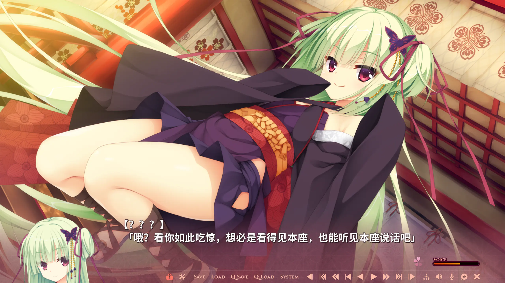
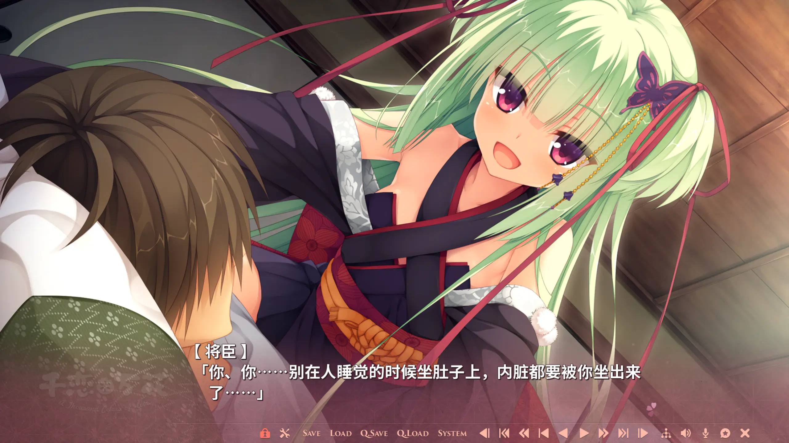
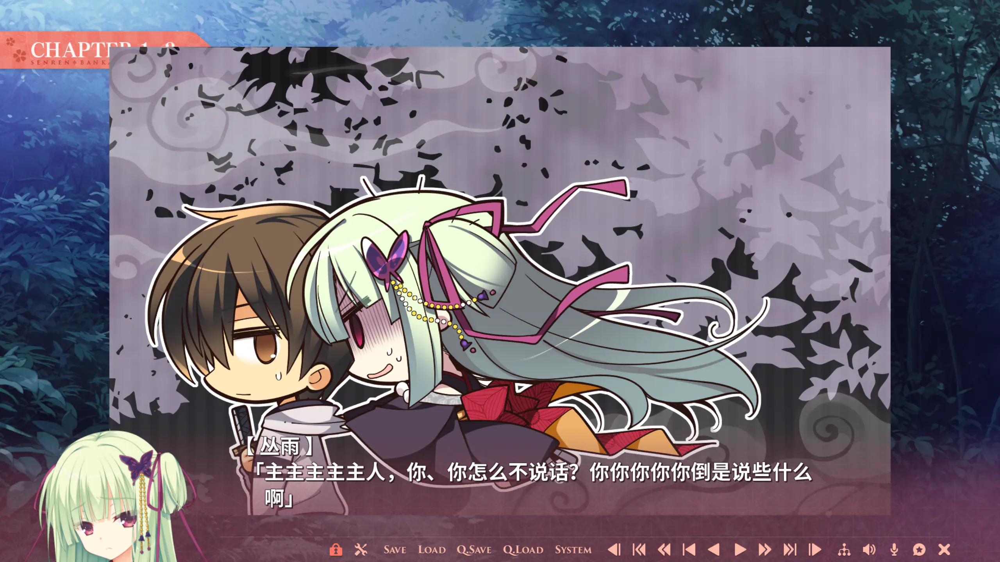
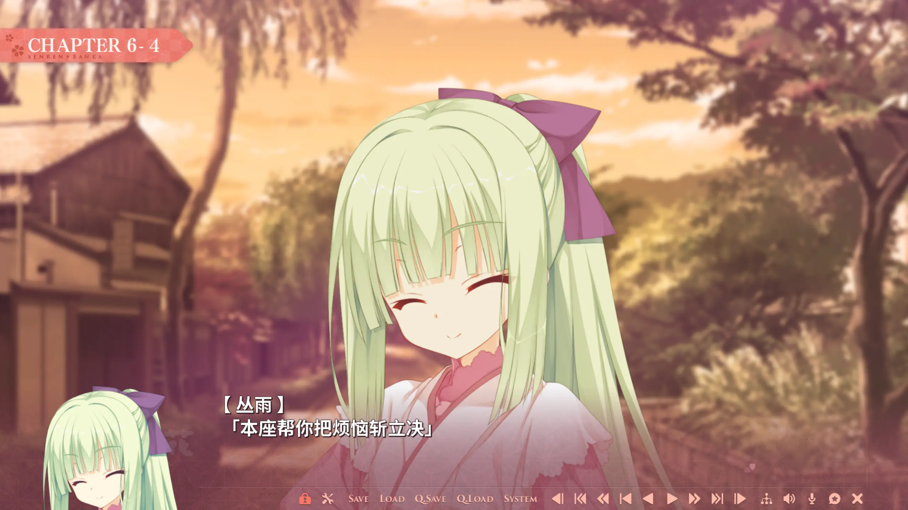
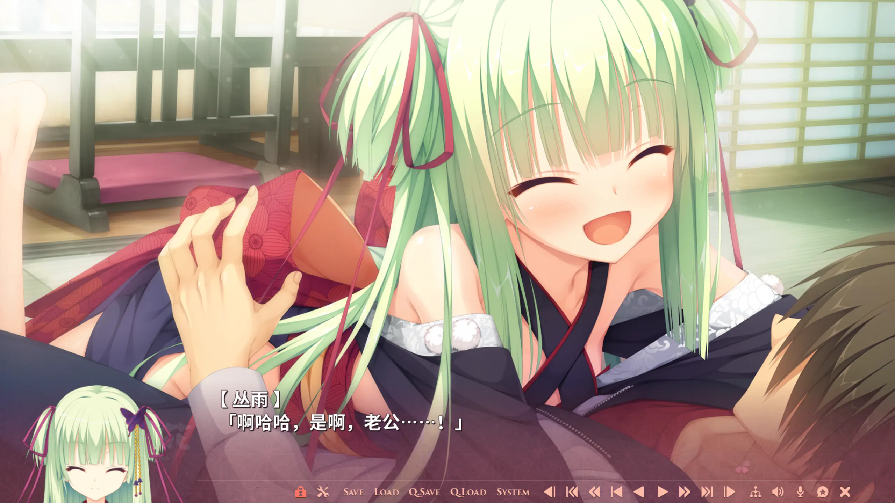
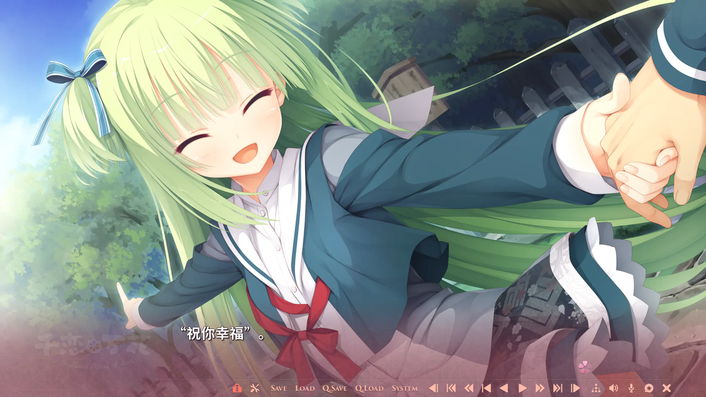

那大概是二〇二四年的事。一位喜欢中野一花的朋友托我送他一部 Galgame,他点名要的,正是这部[《千恋万花》](https://vndb.org/v19073)。那是我第一次听说 Galgame 这种类型——不过在此之前,我已经断断续续玩过一两个月的百合视觉小说,所以它对我而言其实并不算太陌生。就这样,我也为自己买下了《千恋万花》。

在打开它之前,我一直以为自己只会对百合感兴趣。可当我真的抱着试一试的心情点开这部作品,一切都不一样了。

## 在被群山藏起来的小镇里

《千恋万花》的舞台是一座叫"穗织"的小镇——它被群山环抱,曾经与外界隔绝了很久,至今仍保留着浓厚的传统与神祇信仰。镇上的主神社供奉着一柄名为"丛雨丸"的神刀,而主角有地将臣,偏偏就是那个把它拔出来的人。

这是我与她的第一次相遇。随着神刀出鞘,一位说着满口古人腔调的小小少女凭空登场,着实把将臣吓了一跳——她,就是丛雨,神刀"丛雨丸"的剑灵与管理者。数百年前,她以献祭之身成为这柄刀的守护者,自此默默守望着穗织这片土地。如今,她认下拔出此刀的将臣为自己的主人。随着剧情推进,我越来越没办法把目光从她身上挪开了。

## 看得见、也摸得到的那个人

丛雨的处境,其实藏着一份很深的孤独。

她以幽灵般的姿态存在了五百年,却始终否认自己是幽灵;普通人既看不见她,也无法触碰她。只有身负朝武家血脉的人(芳乃与茉子)能够看见她,蕾娜因为长期接触刀的碎片而勉强可见,至于将臣,则是因为吸入了碎片、又恰好被丛雨丸选中,才得以同时看见、并真正触碰到她。当他第一次伸手,真的摸到了"硬硬的、确实存在的东西"时,丛雨在惊讶之余,竟有些害羞。

成为主人之后,将臣的每一天都有了她的身影。清晨,她会用坐到他身上的方式把他闹醒;白天,两人一起在镇上奔走,处理那些寻常人看不见、也对付不了的灵异之事。

我格外喜欢这条线里那些细小的温柔。丛雨没有身体,无法进食,也无法沐浴,却能感受到灵力的存在——于是供奉给神明的酒、蕴着灵力的温泉,都会让她觉得舒服。她提出想被摸头,而当那只手真的落下来,她流露出五百年未曾体会过的、属于人类的温暖与雀跃;她甚至能透过将臣的感官,尝到数百年都不曾尝过的食物。还有一个我很喜欢的对照:穗织本地人都毕恭毕敬地唤她"丛雨大人",唯独将臣只叫她"丛雨酱""小雨"。在所有人眼里她是高高在上的守护神,只有在他这里,她才被当成一个寻常的、会害羞会撒娇的女孩子。

也正是这些不起眼的瞬间,一点点把"孤独"两个字从她身上焐化开来。

## 明明是非人之物,却怕幽灵

丛雨的可爱之处太多了,而最让我忍俊不禁的,是她身为非人的存在,自己却怕得要命的那一面。

明明自己就是一缕活了五百年的刀灵,面对真正的幽灵鬼怪时却会吓得不行。前去祓除的山路上,她因为怕黑而紧紧贴在将臣背后,还会唱起那首越唱越渗人的《笼中鸟》来给自己壮胆——"笼子呀笼子,笼中的鸟儿,何时才能飞出来呢。"明明是为了驱散恐惧,曲调却把气氛烘托得愈发森然,她自己倒先抖了起来。

这种反差非但不违和,反而让她那副"本座最厉害"的逞强格外惹人怜爱。她端着五百年的架子,骨子里却是个会怕、会闹、会撒娇的姑娘。也正是这些小小的破绽,让她从一个传说里的概念,变成了一个让人想要好好守护的、活生生的存在。

## 「本座帮你把烦恼,斩立决」

随着相处渐深,两人也终于跨过了那道朋友与恋人之间的界线。其中最让我难忘的,是丛雨的这一句——

> "本座帮你把烦恼,斩立决。"

第一次听到时,我只觉得这句话很有意思、很有她的风格。可随着年岁渐长,眼看就要毕业、要独自面对那些剪不断理还乱的烦恼,如今的我反而更能掂出这句话的分量。若是真有人能替我把所有烦心事都"斩立决",那该有多好——我偶尔会不由自主地这样想。

而这句话之所以动人,并不在于它真能斩掉什么。它动人的地方在于:有一个人愿意握着刀站到你身前,告诉你"剩下的交给本座"。她未必能替你扛下全部的难处,却让你确信,往后无论遇上什么,你都不再是一个人去面对了。

## 名为"绫"的女孩,与她五百年的使命

越往后走,丛雨的身世也越发清晰,而真相比我想象的更让人动容。

某次宴席之后,将臣撞见了独自在屋外望着月亮落泪的她,这才知道,在成为刀灵之前,她也曾是一个有名有姓的人类女孩——她的本名,叫"绫"。更令人唏嘘的是,神社中那尊被秘藏的"御神体",竟然就是她被完好保存至今的人类身体。当年的她身患重症肺炎,在那个年代几乎是无解的绝症,于是她以献祭之身寄宿进了丛雨丸,化作守护这片土地的剑灵,这一守,就是五百多年。

明白了这一切之后,将臣愈发希望能让她重新变回真正的人。所幸,当年的绝症在今天的医疗面前早已不再可怖;而真正的转机,出现在穗织决定重启那项因神刀被拔走而中断的"奉纳"仪式时。为了亲手把丛雨丸送回神之岩,将臣再一次找回外公,开始了近乎魔鬼式的剑道特训。终于,在奉纳之日,他完美地完成了仪式,将神刀插回原位。丛雨丸向自己的主人与寄宿之人献上了赞赏与祝福——而丛雨,也终于卸下了背负五百多年的使命,彻彻底底地,重新成为了一个完整的人。

## 从"主人",到"丈夫"

恢复人身之后,丛雨以朝武家养女的身份,用"朝武丛雨"这个名字走进了大家的班级,开始体验她迟到了五百年的校园生活。

而最让我心头一暖的,是那个把所有等待都收束起来的结尾:将臣把自己的父母请到了穗织,在双亲的见证下,向丛雨郑重求婚,并得到了所有人的祝福。

这里还藏着一个温柔的细节。丛雨一直唤将臣作"主人"(ご主人さま)——而在日语里,"主人"这个词本身,正是妻子对"丈夫"的称呼。于是同一个称呼,从"主人"到"丈夫",含义在不知不觉间悄悄加深了一层。她以献祭之身唤了五百年的那声"主人",终于也能名正言顺地,叫作"夫君"了。

## 五百年的丛雨,终于落进了一场晴天

故事的结尾,这位舍弃了人类身份、独自守候了五百多年的神灵,终于重新得到了属于一个普通女孩的幸福。看到这里,我也忍不住感慨万千。

我很喜欢这个结局留给人的感觉。丛雨的等待那样漫长,漫长到几乎让人以为它只会是一缕执念的余烬;可作品并没有让她永远停在等待与孤独里。五百年的孤独终究有了回应,迟来的春天也终究照常落了下来。她曾以为自己只能远远守望别人的幸福,到头来,她也成了那个被人用力守护、被人郑重许下一生的人。

后来我才知道,丛雨那首片尾曲名叫《形影成双》。"形影成双"——不再是孤身一人的影子,而是终于有了相伴的形与影。这四个字,大概就是对她这条线最好的注脚。据说在角色歌的封面上,她身旁开着的是红色的曼珠沙华,花语正是"无尽的爱情";如今想来,那既是在暗示她刀魂的身份,也像是早早为这个结局埋下的一句温柔的预言。

回头再看《千恋万花》这个名字,我会觉得它说的正是这种东西——纵使隔着五百年的时光,纵使等待长得几乎没有尽头,只要那个人终于来了,过往所有的孤独便都有了意义。

这大概就是丛雨这条线留给我的东西。

不是关于谁能斩尽世间所有的烦恼,而是关于:哪怕等上五百年,只要身边终于有了那个愿意为你提刀、也愿意握住你手的人,往后的路,就值得用力地一直走下去。
