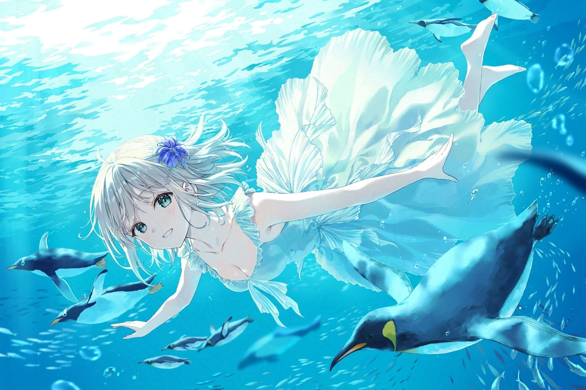
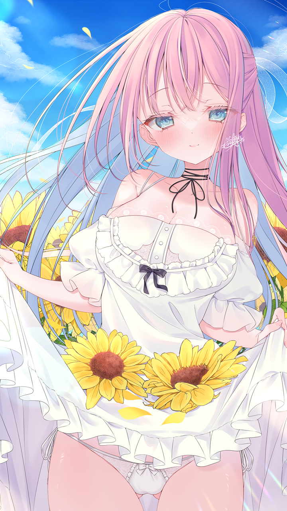
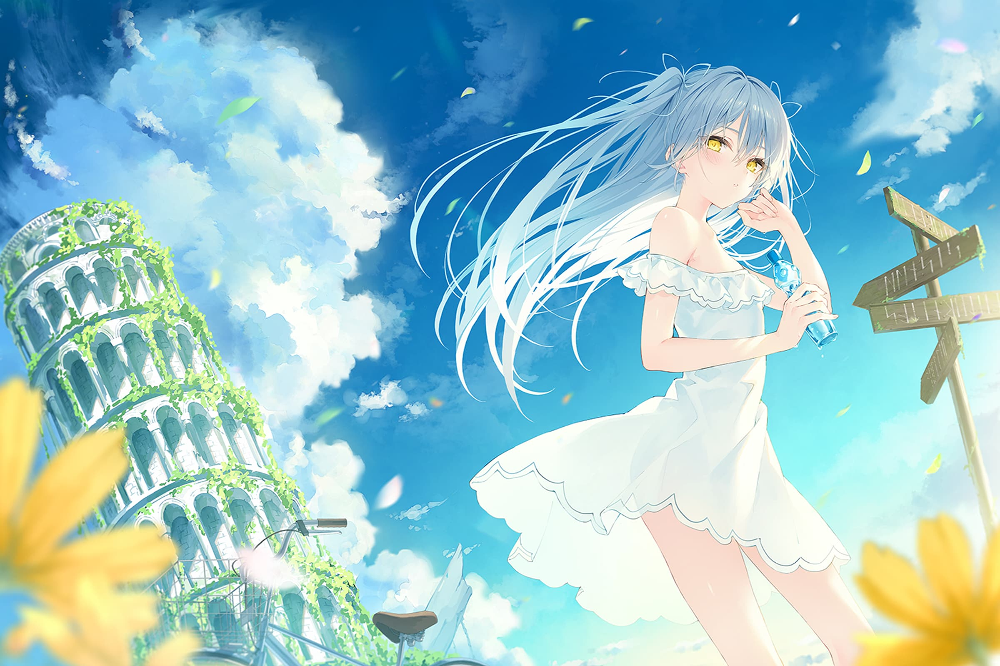
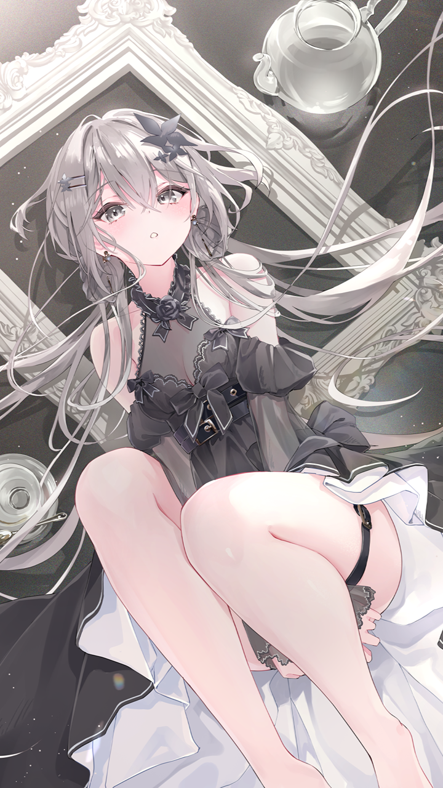

夏天似乎总该有一种明确的颜色。

它可以是汽水瓶外凝结的水珠，是午后被晒得发白的街道，也可以是骤雨前压得很低的灰云。但在我的想象里，夏天最接近蓝色：明亮、透明，远得像是伸手也碰不到，却又铺满了整个视野。

## 潜入比天空更深的地方

海面把阳光揉碎以后，水下就有了另一片天空。

白色裙摆在水流中舒展开来，像一朵没有重量的花。企鹅从身边穿过，气泡沿着光线缓缓上升。陆地上的声音都被留在很远的地方，只剩水流和心跳，于是时间也跟着慢了下来。

有时候，想要的并不是一次真正的远行，只是暂时离开熟悉的节奏。潜进安静的蓝色里，等杂乱的念头沉到底，再轻一点浮上来。

当然，夏日幻想也不总是宏大。它也可能只是冷气充足的甜品店、玻璃杯里的冰块，和一个因为午后太长而显得有些困倦的瞬间。

## 风经过向日葵的时候

如果说蓝色是夏天的背景，那么黄色就是它落在地面上的光。

向日葵把晴朗变得具体。风吹动发梢和衣角，云层在头顶缓慢移动，一切都亮得近乎不真实。这样的画面很像记忆中的某个下午：未必真的发生过，却拥有阳光的温度，也拥有回想时才会出现的柔焦。

路牌指向不同方向，远处的高塔已经被藤蔓覆盖，自行车停在花田旁边。比起抵达哪里，这一刻更像是在等待一次选择。

也许青春里最珍贵的并不是答案，而是站在岔路口时，仍然相信每一条路都能通往很远的地方。云很高，风正好，手里的汽水还没有失去凉意，因此不必急着决定。

## 当白昼褪去颜色

夜晚到来以后，白天饱和的颜色一层层退去。蓝天、花田和海水都沉进记忆，只留下黑、白、灰，以及一点很轻的粉色。

但这并不意味着夏天结束了。

有些景色适合在阳光下看，有些心情却只有安静下来才能辨认。白昼负责把世界照亮，夜晚则替我们收好那些没来得及说出口的话。等到第二天，窗外仍会重新变蓝。

我喜欢这些画面，大概正因为它们共同保存了一种现实中很难停留的时刻：风刚刚吹起，故事尚未开始，所有可能性都还在。

如果能够把夏天调成一种颜色，我还是会选择蓝色。然后放进一点向日葵的黄、一角裙摆的白，最后用夜色给它画上暂时的句号。
