The story of [*Stella of the End*](https://vndb.org/v29443) begins with a delivery job.

Jude is hired to take an android girl named Philia to a distant destination. The object of the job, the route, and the payment are all clear, as though everything will end once he crosses the ruined world and hands over his cargo intact at the appointed place.

But when he finally reaches the destination, Jude says, "What I transported was... my daughter."

I stopped for a long time at that line. It does not deny the long journey that came before, but brings back all the driving, resting, arguing, and looking after one another at once. At some point, the being headed toward that destination had ceased to be cargo. What this job accomplished had long since become more than a delivery.

When I began the game, I was not thinking that far ahead. Philia simply seemed like a very lovable robot girl: direct in speech, curious about the world, and occasionally willful in a way that quickly lowers one's guard. Characters like her are not unusual in Galgame, and I even assumed the story would follow the familiar course of "a cheerful girl heals a distant older man."

*Stella of the End* does portray healing, but it does not hurry to make the two of them a close family. First it makes them walk. It seats them in the same car and has Jude repeatedly perform acts that appear to be no more than part of his job. Only at the ending did I realize that, like Jude, I had changed what I called her without ever noticing.

## What She Wants Is to Be an Ordinary Person

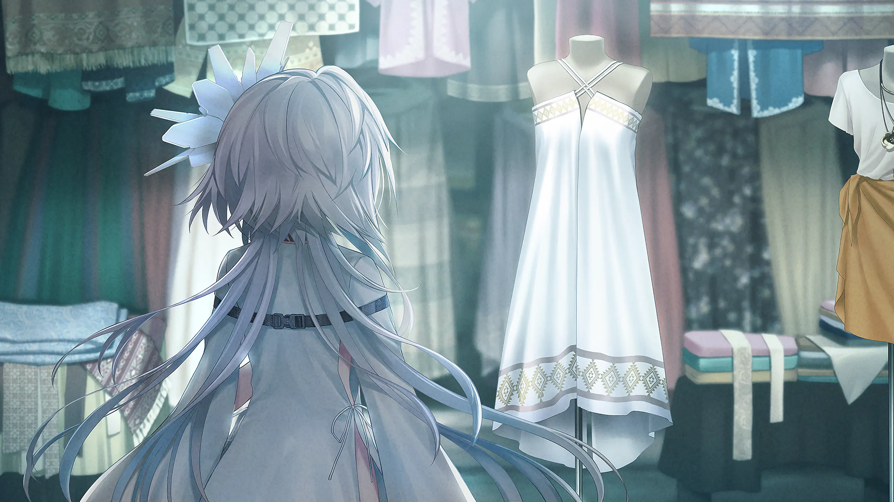

Philia stands before a clothing-store window, looking at the white dress inside. It is easy to read this image as a girl's fondness for pretty clothes, but what she truly longs for is the utterly ordinary life behind that dress.

The first time I saw this CG, Philia and the white dress naturally caught my eye. It is a beautiful image, and she looks adorable standing before the window. But after learning the ending, I pay more attention to the pane of glass. The dress is close enough to touch, yet the display seems to hold an entire daily life she does not possess: choosing clothes she likes, entering a shop, wearing them for someone she cares about, and then worrying about what to wear tomorrow.

These wishes are not grand enough to save the world. They could even be called "useless." Their uselessness is precisely what brings them closer to life. As an android, she was given a function from the moment she was made. What she wants is a white dress that need serve no task at all, and the freedom to say for herself, "I like this."

For Philia, "becoming human" therefore does not mean acquiring some higher qualification. She only wants to be treated as an ordinary person, able to like things, look forward to tomorrow, and decide for herself who she will become.

The very ordinariness of that wish makes her original circumstances feel especially cold.

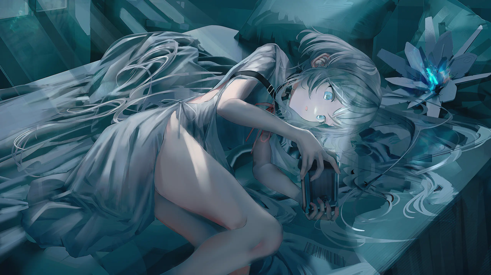

The Philia first presented to the player is not the girl who stops at a window for a dress, but an android lying in a mechanical chamber. Cold light falls across her, and she resembles an object just removed from a container: her body can be inspected, her condition verified, and then she can be loaded into a commission whose destination was written long ago.

She has a human appearance, yet enters Jude's world as "cargo." Jude must care whether she remains intact, but has no need to understand what she thinks. The distance between them at first is not intimate but professional.

I love that the story does not immediately erase this distance. Jude's detachment can even become frustrating, but it fits who he is and leaves a visible trace of every change that follows. Had the opening gently told the player, "They will become father and daughter," the final word *daughter* would merely confirm an established relationship. That is not what happens. They truly have to travel an entire road to earn it.

## From Cargo to Traveling Companion

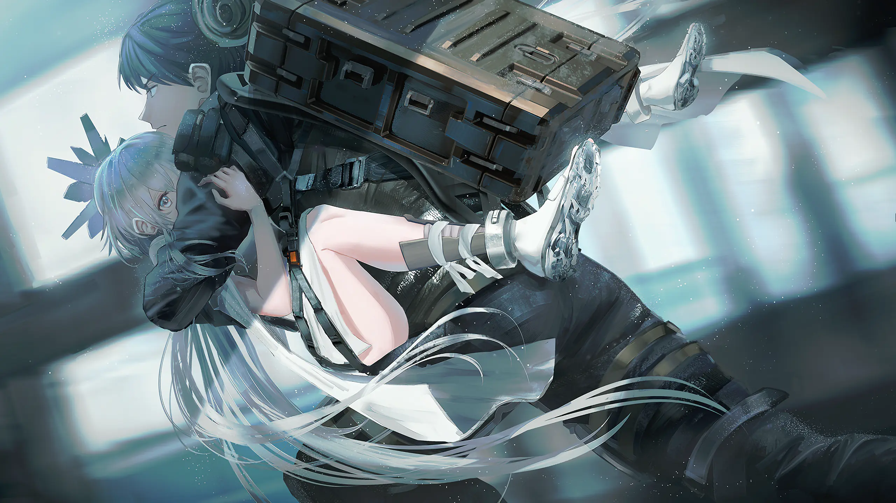

When Jude picks Philia up and carries her forward, the image resembles a rescue, but this is not yet the beginning of a tender story. He has simply accepted a job, and she is the object that must be delivered. He protects her first because a transporter is supposed to keep his cargo safe.

This distant beginning matters. *Stella of the End* does not use one sudden event to transform them. Their relationship develops little by little across a long, dangerous, and mundane journey. Much of the time, even the characters may not notice it.

At rest, Philia is quiet and entirely unguarded. She grows tired, can be hurt, and entrusts her safety to the person beside her. Her vulnerability cannot prove that she is human, but it makes the word "cargo" increasingly difficult to sustain. Faced with a being who depends upon him, Jude cannot forever calculate only routes and risks.

The first time I clearly felt Jude's attitude change was not when he said something tender, but precisely because he still did not know how. His words retain the tone of a transporter, while his actions begin to move ahead of that hard language: stopping to wait for her, checking her condition, and instinctively putting her before himself when danger comes. The requirements of the job can explain any one of these acts, but struggle to explain them all.

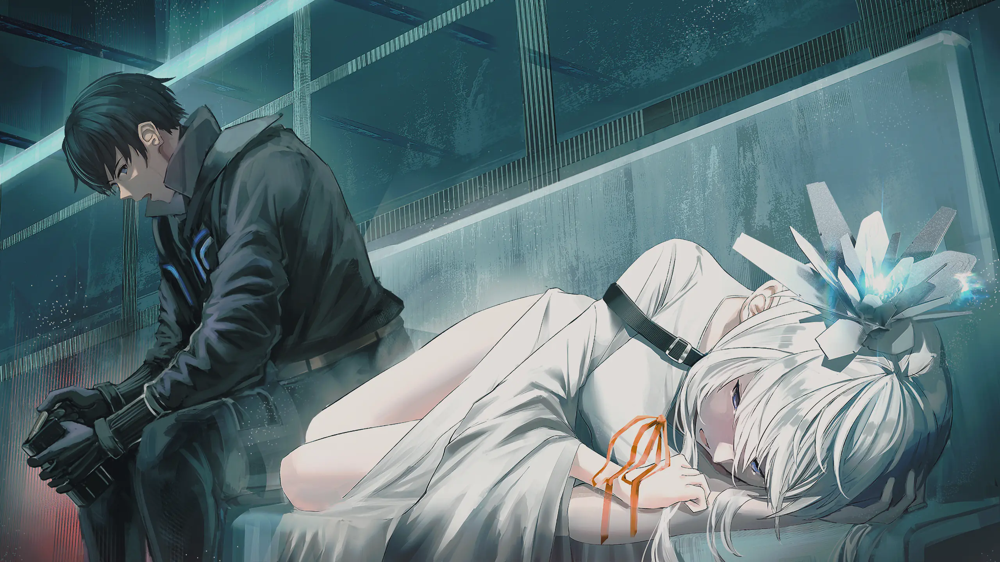

The car continues toward the same destination, but the relationship inside has already changed. Philia can sleep beside Jude because she trusts him to keep driving. Jude, too, begins to notice not only whether the cargo is damaged, but whether she sleeps peacefully and can endure the journey.

To be honest, the middle of the trip is not always tense. Driving, finding somewhere to stay, dealing with trouble, and setting out again: some stretches even feel slow, and the structure becomes slightly repetitive. While playing, I occasionally wished the next major event would arrive sooner.

At the ending, however, I felt that this slowness could not have been removed. Caring for someone rarely happens dramatically. More often, it is simply remembering to let her rest today, then standing before her again when danger comes tomorrow. Similar days accumulate one by one until an action changes from a job requirement into a habit. Jude may not be able to say where that boundary lies, and neither can I. But by the time Philia can sleep soundly in the passenger seat, they are plainly no longer the people who departed together.

Care and transport look similar on the surface: providing food, avoiding danger, and keeping to the journey. The difference lies in small places. Transport asks whether an object can be delivered intact. Care wonders how she will feel when she wakes, whether she is afraid, and what kind of scenery she hopes to see.

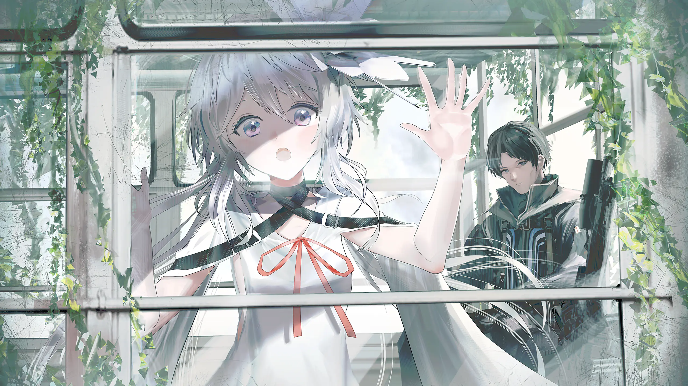

Philia looks through the car window at the world outside. The ruins do not return to their former state for the sake of her curiosity, but to her, the clear glass, passing light, and unseen landscape at the end of the road remain worth watching.

I love the expression on her face as she looks outside. Post-apocalyptic stories often allow us to see only decay, but she looks as though she is discovering for the first time how much the world contains. Her curiosity is not childish. It reminds me that these ruins were once someone's ordinary life, and that death need not be all that remains after ruin.

She begins to observe the road, understand this world, and form choices through what she experiences. What sits beside Jude is no longer cargo waiting to be received. They have seen the same wasteland and shared the same silences. It is in these moments that "traveling companion" slowly becomes the right name.

## Who Deserves to Be Called Human Among the Ruins?

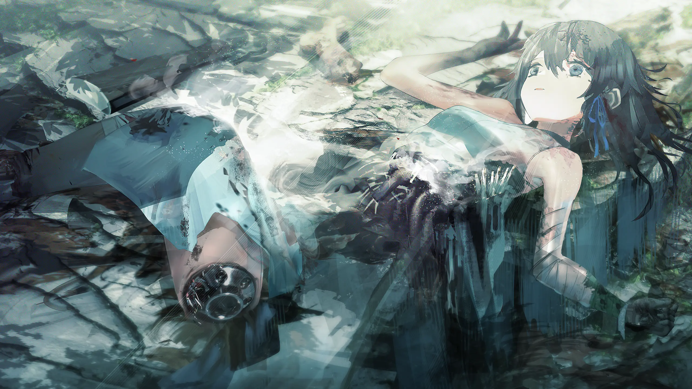

The apocalypse in *Stella of the End* is not a beautiful backdrop placed behind its characters. Bodies break, resources always run out, and many choices offer no perfect answer. Again and again, it brings forward a question easily set aside in peaceful life: where does the boundary between human and machine truly lie?

When Delilah lies broken, the inside of her mechanical body is exposed among the ruins. My first response was not to calmly consider whether she "counts as human," but to feel pain. The bare components remind me that she is indeed different from a human, but what came before makes it impossible to treat the sight as a machine being scrapped.

This hesitation carries more force than a standard answer. Flesh can be damaged and machinery can be damaged. People are changed by their surroundings, while androids are likewise shaped into different selves by memory and harm. Structure can explain a body, but not every reason that brought her here.

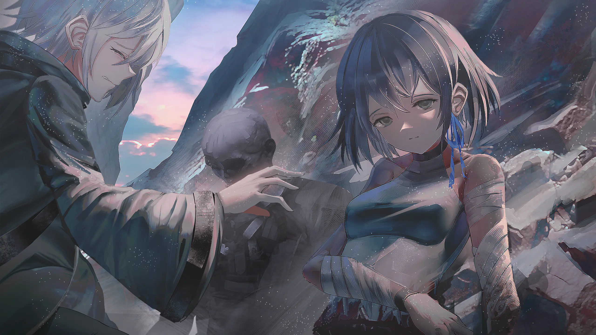

Delilah is also a mirror for Philia. Similar construction does not lead them to the same ending. What was written into them at manufacture certainly matters, but so do the people they later meet, the treatment they receive, and the choices they make when there is nowhere left to retreat.

Philia receives trust and companionship on her journey; Delilah presents another possibility. "Philia is becoming more human" can no longer be offered as casual praise. Possessing a will does not automatically bring happiness. The world can hurt her, and she must bear the consequences of her choices.

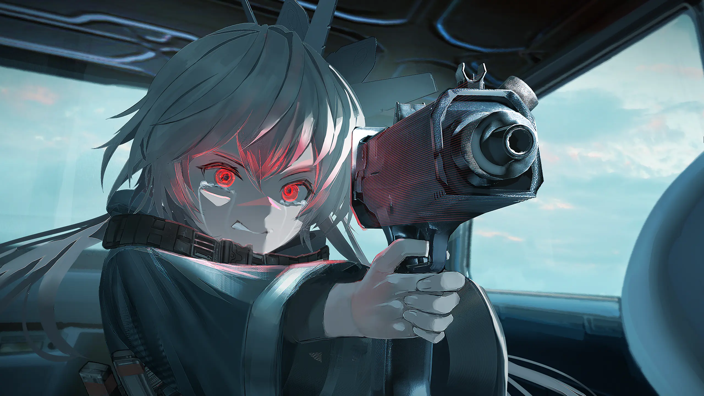

When Philia raises a gun with glowing red eyes, she is no longer the child who can only wait for Jude to protect her. She has begun to use her own strength to guard what matters to her.

The scene is powerful, yet I cannot simply call it "cool." The girl who once looked at a white dress through a shop window has now learned to aim a weapon at someone. She has indeed grown, but the cost is plain. Jude can teach her how to survive, but cannot forever keep the world's cruelty beyond her sight.

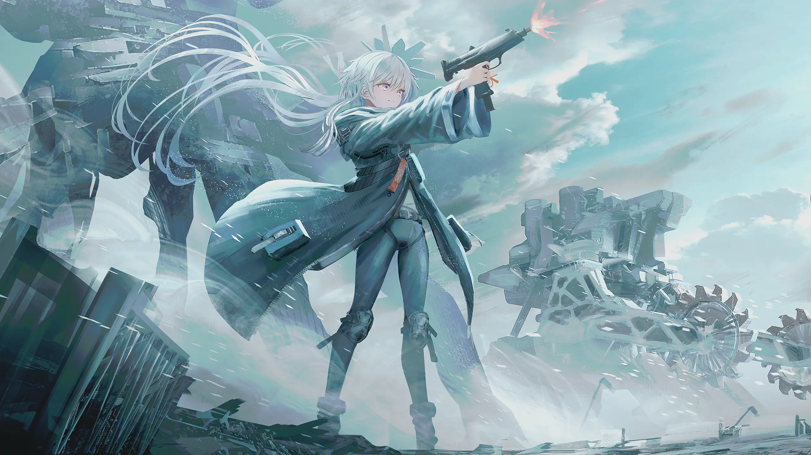

The colossal mechanical remains press down upon the wasteland, making Philia's figure seem very small. This world never welcomes her gently merely because she wants to be human. It teaches her curiosity and forces her to learn to shoot. It gives her a traveling companion and makes her understand that loss cannot be avoided.

She does not "upgrade" from machine to human. What truly changes is that she no longer accepts a purpose prescribed by others. Why she acts, whom she is willing to protect, and what price she will pay are questions she begins to answer herself. By this point, she no longer needs the construction of her body to prove whether she is human.

## Tenderness Among Cold-Colored Ruins

When writing about the journey in *Stella of the End*, it is difficult to separate SWAV's art from the experience. The first thing this world gives me is cold. The skies and mechanical spaces carry translucent blues. Metal surfaces hold little warmth, and abandoned cities are so quiet that even their echoes seem to have vanished. The images rarely paint the apocalypse as a dirty blur. On the contrary, they are always clean, spacious, and almost transparent.

That transparency makes the desolation more apparent. Philia's white clothing is both conspicuous and fragile within it, while greenery returning among the ruins preserves a trace of life in a world long dead. Farther away, the remains of giant machines vastly exceed the human scale. The characters stand tiny before them, as though they could be swallowed at any moment by the shadow of the old civilization.

Yet many of the images I remember are moments of tenderness within these cold colors. Philia asleep in the passenger seat, her eyes looking through the car window, and Jude's unspoken concern are all supported by broad, quiet backgrounds. The colder the image, the easier it is to see the warmth just beginning between two people.

The CGs are not rewards handed to the player after reading a section of the story. They are more like milestones. The white dress in the window marks Philia's wish. Her sleep in the car marks the trust that has formed. Her red eyes and raised gun fix the cost of growth upon the screen. At the ending, several CGs with similar compositions deliberately refuse to let the player escape. We can only remain there and watch the two finish speaking the name they have finally found.

The music does something similar. Melodies on the road rarely force themselves ahead of the dialogue. They leave room for the repeated journey, making it feel as though the wheels truly have been turning for a very long time. In their quiet moments together, the sound recedes, allowing unexplained acts of care to linger. When the farewell arrives, familiar feelings return, and all that seemingly uneventful time presses down at once.

I find it difficult to summarize this experience as simply "the music is beautiful." It is closer to the air of the journey, not something noticed in every second of play, but something that, once I stop, I realize has supported much of the lingering emotion. Especially the silence between the final lines. The story does not hurry to demand tears, and instead gives us time to understand: they truly are going to say goodbye.

*Stella of the End* naturally has regrets as well. It is not an enormous, multi-route Galgame with many characters and paths to revisit. The middle of the journey is not always eventful, and some incidents follow similar rhythms. Fascinating parts of the setting often show only one corner before the travelers move on. I certainly had moments of wishing a particular idea had been explored more deeply.

But its length and restraint also keep the main story from ever scattering. The undeveloped setting leaves some regret, and the slower road sections occasionally test one's patience, but neither damages the final emotion. On the contrary, when the story draws its focus back to Jude and Philia, I know clearly that what I have awaited throughout the journey is not the answer to some mystery of the world.

It is what they will call one another.

## What He Transported Was His Daughter

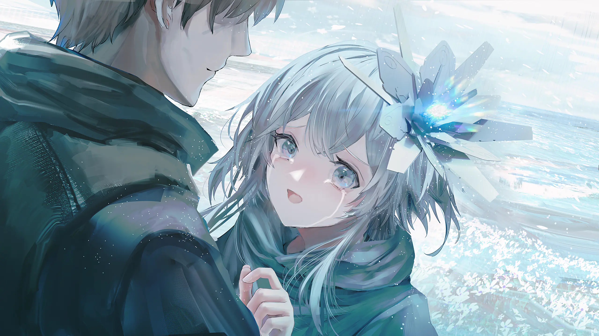

After the gunfire, the story leaves its final time to the two of them. There is no greater enemy and no new answer. Philia looks at Jude through tears, and all the care, dependence, and attachment left unspoken along the road must finally be given a name.

From here, I could barely keep myself outside the story. The earlier dangers made me tense, and Delilah's fate hurt, but only when the image became quiet did I truly understand that this journey was ending. The story does not rush into the next scene. It lets Philia look at Jude, and makes the player wait beside her for those few words.

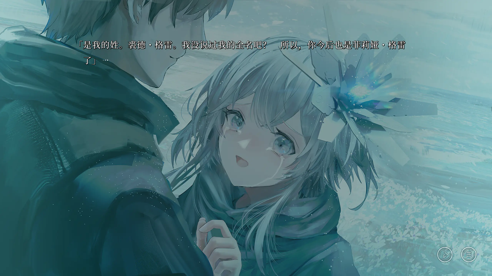

Jude gives Philia the surname "Gray."

At the beginning, names, model numbers, and the object of a commission seem little different. All are symbols used to identify her. But "Gray" is different. It comes from the road they traveled together, not an ownership label affixed to an object. Philia no longer needs to introduce herself only by model and purpose. Even if Jude cannot accompany her through the rest of her life, she can carry this name with her.

Nor is this a ceremony that turns Philia into a human. When she gazed at the white dress, grew curious about the world beyond the window, and raised a gun to make her own choice, she was already living a life of her own. Jude merely speaks at last the change that had long since occurred between them. He no longer hides behind his identity as a transporter.

By this point I could guess what he might say next, yet the actual wording still went beyond what I expected. Not a partner, not an important person, and not the vague word "family." Jude chooses one very specific name.

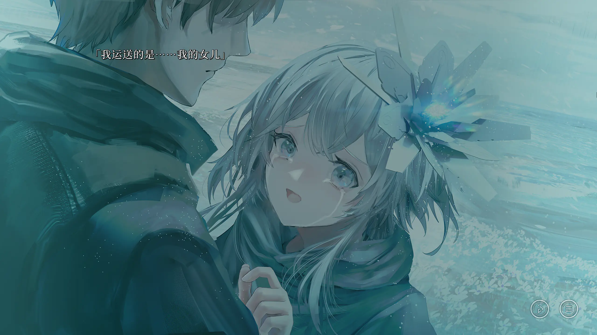

"What I transported was... my daughter."

This is the most important line in all of *Stella of the End*.

"Transport" originally belongs to the language of a profession. It requires Jude to safely deliver the specified cargo to the specified location. Once it is handed over, the relationship ends, and payment settles everything spent along the way. "Daughter" belongs to another language entirely. A daughter cannot be replaced, and caring for her has no price that can be settled. Even after the job ends, she will remain in Jude's life.

Jude does not deny that this was a delivery. He still uses that hard, even impersonal word. That is precisely why it bears so much weight at the ending.

The first thing that returns to my mind when I hear "my daughter" is not a decisive battle, but Philia asleep in the car. I remember Jude carrying her, waiting while she rests, and taking her away from each stopping place to continue onward. Scenes that had seemed like mere procedure suddenly carry weight. The actions have not changed; what has changed is that I finally understand the relationship to which they belong.

The words "my daughter" reinterpret the same road, the same job, and the same destination from the beginning. What he protected was not merchandise that needed to remain intact. Before he even realized it, he was learning to be a father; and in the last thing he could do, he left his daughter a path on which to live.

Thus, "I delivered my daughter... to her destination" sounds at once like a transporter's report and a father's acknowledgment of his final escort.

The two identities overlap in this moment. As a transporter, he completes the commission. As a father, he delivers a child once treated as cargo to a place where she can possess a name, make choices, and live on her own. The destination is no longer simply a coordinate on a map. It is the place from which Philia can set out again under the name "Philia Gray."

Calling himself her father does not give Jude ownership of Philia's life. The last thing he does is let go. He cannot walk through her future for her; all he can do is bring her to its entrance. And then, watch her go.

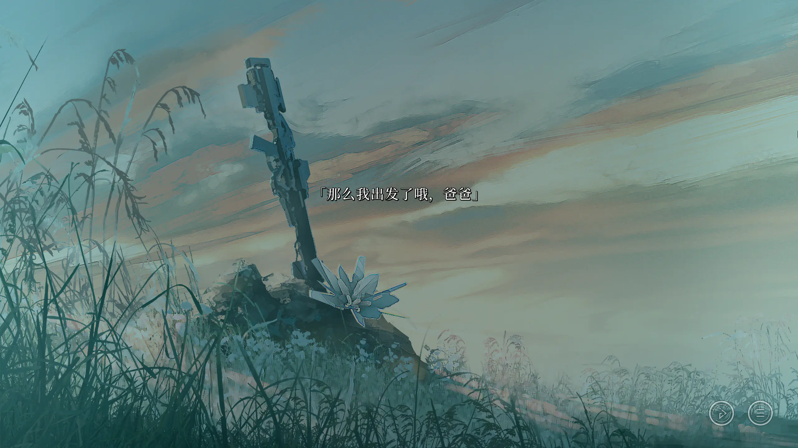

"Well then, I'm off, Papa."

Reading "Papa" hurt me even more than seeing "daughter." Jude offers the name first, and Philia answers him with this one word. Only here do father and daughter cease to be merely my interpretation of their relationship and become the name they choose together.

And just after they finally say it, they have to part.

Philia does not say merely "I'm leaving," but "I'm setting out." The meanings are close, but the emotions are entirely different. "I'm leaving" easily holds one's gaze on the farewell. Setting out turns that gaze toward what lies ahead. She accepts the name Jude gave her and also accepts that the remaining road is hers to walk.

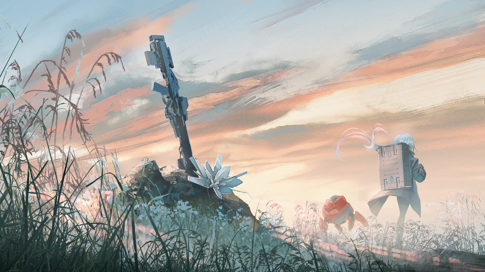

In the distant view without dialogue, Philia carries her case and walks away. The game does not make her stand there crying forever, nor use more dialogue to summarize her feelings. She turns around and truly takes her first step.

This image makes me sad, but not only sad. The name Jude gives her does not bind her to the place of their farewell. It is more like luggage she can carry on the road. She will remember who brought her here and take that memory into a world Jude will never see.

At the journey's beginning, she was picked up, loaded, and transported by someone else. At its end, she chooses a direction on her own feet. Everything *Stella of the End* accomplishes for Philia's growth lies between those two images.

## The World Ended, but the Journey Continues

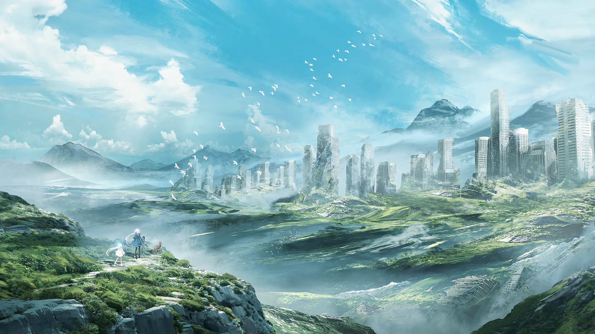

The world of *Stella of the End* lies broken, yet green growth covers the ruins again. A city stands silently in the distance, the sky remains vast, and the road does not disappear at the edge of the image.

This final distant view does not seal the emotion inside a sorrowful close-up. The people grow small and the world opens again. My strongest feeling here is that she has truly set out. Not as cargo waiting for the next recipient, nor as a child who can only follow Jude. She carries her own belongings and her own name toward somewhere she has never seen.

Looking back, Jude delivers far more than Philia's body. He brings her from "cargo" with a prescribed function to the companion sitting beside him, and then delivers that companion to the place where she can begin her own life as his daughter.

That is why "delivered to her destination" gives this job a weight far beyond a handoff. It does not say that the cargo has arrived. It says that a father has completed his last escort, and that a daughter begins living on her own from here.

The job ends, but their relationship will not be settled along with the payment.

After finishing the game, I still think of Philia standing before the shop window and looking at the white dress. At the time, she longed for an ordinary human life as though a pane of glass still separated her from it. At the end, she receives no promise of happiness, nor does she wait for a world completely restored. She simply has a name, once had a father, and then sets out on the road herself.

That is enough to change everything.

The world may have ended once. Her journey has only just begun.
