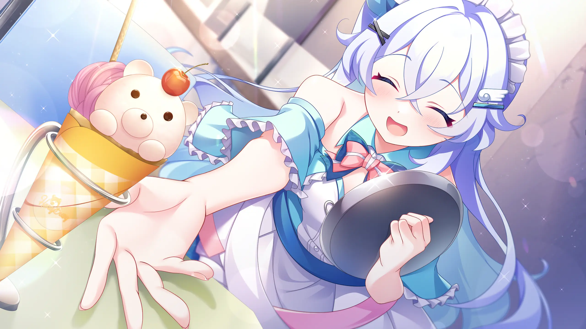

The internet is always moving forward.

A page we read yesterday may suddenly disappear. A familiar community may change beyond recognition, and once-lively chat windows slowly sink to the bottom of the list. We have more ways to express ourselves than ever, yet many of the things we truly loved still end up as a screenshot buried deep on a hard drive, or a save file we never open again.

That is why I wanted to build a little site of my own.

## A Screenshot I Do Not Want to Lose

*Rather than leave screenshots buried on my hard drive, I want to give these cherished moments somewhere I can return to.*

The girl in the picture is Yaotome Suzuka, one of the main heroines of SMEE's sweet romantic-comedy visual novel *LOVEPICAL-POPPY!* (ラブピカルポッピー！), and the younger sister of the protagonist, Yaotome Tetsuya.

The game begins in a bit of a rush. A fire leaves the siblings temporarily without their old home. Suzuka moves into the dormitory at Hoshikuzu Academy, while a twist of fate makes Tetsuya the live-in dorm mother of the girls' residence, with a second job helping at the attached crepe cafe. The story unfolds from this new everyday life.

But I do not want to retell an entire route here, nor turn this post into a character profile. What made me want to keep this image was something much more personal, a feeling that quietly accumulated as I played.

## Wanting to Rely on Someone, and to Be Their Support

Suzuka has long blue hair and blue eyes that are easy to remember, along with the gentle, refreshing air of a younger-sister heroine. But describing her as merely "cute" seems to leave out the part that matters most to me.

She is diligent and earnest, excels at school, and is capable in almost everything she does. At the same time, she has very little stamina, is poor at sports, and struggles with communal life. She becomes especially guarded around unfamiliar men. She is not someone who handles everything with effortless composure. Even amid her weaknesses and anxieties, she keeps trying to do things well.

She is very close to her brother and plainly adores him. She relies on Tetsuya, yet does not want to remain forever the little sister who is cared for. She wants to become independent, and she also hopes her brother will rely on her more. That wish to stay beside the person who makes her feel safest while becoming someone he can safely lean on makes her fragility and competence feel not contradictory, but especially real.

That is the Suzuka I like. She is not a symbol whose only purpose is to be adorable, but someone who feels fear, depends on others, and still earnestly tries to take one step forward. The bond between the siblings is not protection flowing in only one direction. When neither of them is entirely dependable, they gradually learn to support each other.

## Making a Place for the Stories I Love

Liking a character does not always become a complete review. Sometimes what remains is a single line, a short stretch of time together, or the feelings from those days of playing that return when I see a certain screenshot. These feelings are small and difficult to fit into scores or lists of strengths and flaws, but that does not make them unimportant.

Here, I do not need to chase recommendation algorithms or compress every feeling to fit a timeline. I can write about the lingering emotions a Galgame left behind, note why a certain character stayed with me, or simply post one screenshot and place a few quiet paragraphs beside it.

Later, I began calling this site "Suzuka." It is more than a convenient name to remember; it also feels like a bookmark left inside this affection. Whenever I see the site's name and that pale blue figure, I remember why I was willing to spend the time building this place little by little.

## A Note to My Future Self

The point of keeping a record is not necessarily for many people to see it. Perhaps years from now, I will be the only one who happens to return here, sees Suzuka's smile again, remembers *LOVEPICAL-POPPY!*, and recalls how I felt sitting in front of the screen at the time.

That would already be enough.

I hope this blog can be a tiny digital garden. It does not need to be lively. It only needs to quietly preserve the works, characters, screenshots, and feelings I once loved. Even if all of it is ultimately left for my future self, it will still be proof that I was here, and that I once cared for these things with all my heart.
